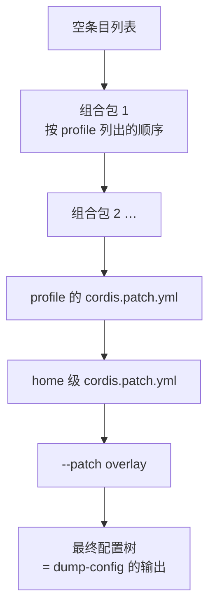

# 一棵树怎么长出来

<div class="chapter-meta">
<span class="badge lv2">架构</span>
<span class="badge time">约 12 分钟</span>
<span class="badge">配合 --dump-config 看</span>
</div>

<div class="goal">
<div class="goal-title">读完这章你会</div>
<ul>
<li>看懂 <code>dsh --profile web --dump-config</code> 的输出</li>
<li>知道自己的定制该放在哪一层</li>
<li>拿到一张「三个事件域」的选择表——选错域是最常见的架构错误</li>
</ul>
</div>

## 回到第一章那个问题

你在[第 01 章](#/quickstart)跑过 `--dump-config`，看到一大坨看不懂的东西。现在来拆解它。

运行中的 `dsh` 是**一棵插件树**，由启动时**按顺序叠加**的几层组合而成。就像 Docker 镜像的层，或者 CSS 的层叠——**后面的可以覆盖前面的**。

## 两个概念

<div class="analogy">
<div class="analogy-title">开分店</div>
<strong>组合包（bundle）</strong> = 一套<strong>标准化的部门套装</strong>。「基础运营包」含财务、人事、法务；「门店包」再加收银、导购。<br><br>
<strong>profile</strong> = 一份<strong>开店方案</strong>：这家店用哪几个套装，外加本店自己的特殊安排。
</div>

对回官方定义：

**profile** 是存放在 Harness home 里的**具名组装**。它做三件事：

- 列出自己要叠的组合包
- 存放自己安装的树外插件
- 保存用户自己的 `cordis.patch.yml`

`web` 和 `headless` 作为模板随发行版交付。

**组合包** 是「Cordis 配置项 + 挂载它们的代码」的**分发格式**。关键性质：它插入的内容**始终可以被上面的层 patch**。

两者都在自己的 `package.json` 里用 `dsh` 字段声明身份：

| 字段 | 含义 |
|---|---|
| `dsh.profile` | 列出这个 profile 用哪些组合包 |
| `dsh.bundle` | 指向这个组合包的 patch 文件 |

## 三个内置组合包

| 组合包 | 装了什么 |
|---|---|
| **`dsh-base`** | **每个 profile 的第一层**：模型适配器、工具、持久化、沙箱与审批策略、设置、凭据、遥测 |
| `dsh-web-app` | 加浏览器应用 |
| `dsh-headless` | 加一次性运行器，**完全不带服务器** |

## 叠加顺序

这是本章最需要记牢的：



一条 patch 只做两件事之一：

- 按 `id` 找到某个条目，**替换它整个 config**
- **插入**新条目

<div class="callout warn">
<span class="callout-title">是「替换整个 config」，不是深度合并</span>
写 overlay 时这点很重要。你不能只改 config 里的一个字段——要写就得把这个条目的 config 整个给全。
</div>

## 你的定制该放哪一层

<div class="versus">
<div class="good">
<div class="vs-head">临时试验 → --patch</div>
<div class="vs-body">

```sh
dsh web --patch ./my.cordis.yml
```

<p>最外层，优先级最高。改完删掉不留痕迹。</p>
</div>
<div class="vs-note">实验二就是这么做的</div>
</div>
<div class="good">
<div class="vs-head">长期配置 → profile 的 patch</div>
<div class="vs-body">

<p>写进 profile 自己的 <code>cordis.patch.yml</code>，或 home 级那份。</p>
<p>每次启动都生效。</p>
</div>
<div class="vs-note">个人常驻定制放这</div>
</div>
</div>

<div class="try">
<div class="try-title">现在再跑一次</div>

```sh
dsh --profile web --dump-config
```

对着上面那张叠加图看输出。你现在应该能认出：条目的 `id`（patch 用它定位）、`name`（包名）、`config` 块（[第 07 章](#/cordis-config)那个经过 schema 校验的东西）。

架构文档的原话：**「它打印出的任何条目，都可以由你自己的 patch 替换。」**
</div>

## 核心包地图

树上都长了些什么？这些是主干：

| 包 | 职责 | `ctx` 键 |
|---|---|---|
| `core/session` | 只能追加的 `SessionEvent` 日志 | `ctx.sessions` |
| `core/system-prompt` | 组装提示词片段与工具 schema | `ctx.systemPrompt` |
| `core/tools` | 工具注册表 + 带把关的执行流水线 | `ctx.tools` |
| `core/agent` | **`Agent` 接口**、活跃 agent 注册表、`agent/*` 事件 | `ctx.agents` |
| `core/agent-loop` | **实现该接口的默认驱动器** | `ctx.agentLoop` |
| `core/scope` | 按 agent 划分作用域的注册原语 | 库，无 ctx 键 |
| `llm/llm` | 消息与流式词汇表，适配器插口 | `ctx.llm` |

<div class="callout key">
<span class="callout-title">注意 agent 和 agent-loop 是两个包</span>
<code>core/agent</code> 是<strong>接口</strong>，<code>core/agent-loop</code> 是<strong>实现它的默认驱动器</strong>。<br><br>
这个拆分就是「主循环可替换」的技术形式。配套规约：<strong>「扩展插件依赖 Service Definition，绝不依赖具体提供方」</strong>——UI、钩子、工具插件都只依赖 <code>dsh-agent</code>，<strong>不依赖 <code>dsh-agent-loop</code></strong>。于是循环保持可换。
</div>

## 三个事件域

<div class="callout key">
<span class="callout-title">「事件就是扩展点，而选对事件域是大多数改动的第一个决定。」</span>
</div>

| 事件域 | 是什么 | 什么时候用 |
|---|---|---|
| **会话事件** | 追加到日志、通过 `session/event` 广播的**持久事实** | 这个事实**重启后必须还在** |
| **Agent 事件**（`agent/*`） | 携带活跃 `Agent`：inbox、步骤、状态、请求、续跑 | 观察或拦截**正在进行**的工作 |
| **能力事件** | 给某个插口挂策略和适配器（`fs/*`、`tools/*`、`telemetry/*`） | 给某项能力加策略 |

选错的典型症状：

<div class="story">
<div class="line me"><div class="who">症状一</div><div class="says">我做的功能，重启之后就丢了。</div></div>
<div class="line sys"><div class="who">诊断</div><div class="says">该用会话事件，你用了 agent 事件。</div></div>
<div class="line me"><div class="who">症状二</div><div class="says">我往会话日志里写了一堆临时状态，日志膨胀得很难看。</div></div>
<div class="line sys"><div class="who">诊断</div><div class="says">反了。瞬时协调状态属于 <code>agent/*</code>，不该进持久日志。</div></div>
</div>

<details class="deep">
<summary>包是怎么分组的<span class="deep-tag">找代码时有用</span></summary>
<div class="deep-body">

`packages/<组>/<包>/`，但包名里**不带组名**（始终是 `@deepseek-ai/dsh-<pkg>`）。

| 组 | 职责 |
|---|---|
| `core/` | 产品 API 主干 |
| `llm/` | 模型能力：抽象服务 + 提供方适配器 |
| `shell/` | Bash：插口 + 本地实现 + 模型可用的工具 |
| `fs/` | 文件系统 |
| `terminal/` | 持久 PTY |
| `sandbox/` | 进程限制；bwrap / Landlock / Seatbelt 后端 |
| `subagent/` | 子 agent 能力与委托工具 |
| `session/` | 持久化插口 + JSONL/SQLite 后端、投影、标题 |
| `interaction/` | 人机协作：审批、权限预设、命令 |
| `bundle/` | 可安装的 profile 补丁层 |
| `extensions/` | **agent 运行时自修改** |
| `client/` / `host/` | Web GUI 的浏览器侧 / 宿主侧 |

</div>
</details>

<div class="quiz">
<div class="quiz-q">你想让某个功能「重启 dsh 之后仍然生效」，该用哪个事件域？</div>
<button class="quiz-opt">Agent 事件（<code>agent/*</code>）</button>
<button class="quiz-opt" data-answer="yes">会话事件（追加到日志，<code>session/event</code> 广播）</button>
<button class="quiz-opt">能力事件（<code>fs/*</code>、<code>tools/*</code>）</button>
<div class="quiz-why">只有会话事件是<strong>持久事实</strong>。<code>agent/*</code> 是实时协调接口——队列、状态、拦截——进程一停就没了。下一章讲轮次流程时，你会看到这两类事件在同一张图上交替出现，分清它们很关键。</div>
</div>

<div class="recap">
<div class="recap-title">带走这三句</div>
<ul>
<li><strong>组合包铺底，patch 覆盖</strong>，从空列表开始一层层叠成最终的树。</li>
<li><strong>接口和实现分两个包</strong>（<code>agent</code> vs <code>agent-loop</code>），所以连主循环都能换。</li>
<li><strong>动手前先选事件域</strong>：要持久用会话事件，要拦截用 <code>agent/*</code>，要挂策略用能力事件。</li>
</ul>
</div>

<div class="pathline">
<a href="#/cordis-hmr">08 改组织不用重启</a>
<span class="sep">→</span>
<span class="now">09 一棵树怎么长出来</span>
<span class="sep">→</span>
<a href="#/arch-turn">10 模型的一个回合</a>
<span class="sep">→</span>
<span>11 记账</span>
</div>
