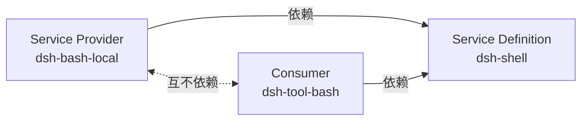

# 换灯泡不用换电线

<div class="chapter-meta">
<span class="badge lv2">架构</span>
<span class="badge time">约 14 分钟</span>
<span class="badge">最有迁移价值的一章</span>
</div>

<div class="goal">
<div class="goal-title">读完这章你会</div>
<ul>
<li>理解「换个提供方就改变整个产品」的完整机制</li>
<li>知道什么时候<strong>该</strong>拆三个包，什么时候<strong>不该</strong></li>
<li>拿到一份 harness 全部能力插口的索引</li>
</ul>
</div>

## 从一个惊人的结论说起

架构文档里有一句话，第一次读会觉得夸张：

> 文件系统与进程提供方**共享同一个执行世界**，因此把它们指向远程沙箱，也就把 **Bash、PTY 和 LSP 一并搬了过去**，无需提供方专用 fork。

翻译：改两个提供方，**三个功能自动跟着迁移**。不用给 Bash 写一份远程版、给终端写一份远程版、给语言服务器再写一份。

这一章讲这件事凭什么成立。

## 三个角色

<div class="analogy">
<div class="analogy-title">灯座、灯泡、房间</div>
<strong>灯座标准（E27）</strong> = Service Definition。规定了尺寸和电压。<br>
<strong>灯泡</strong> = Service Provider。白炽灯、LED、智能灯泡，随便换。<br>
<strong>房间</strong> = Consumer。它只管「开灯」，不关心里面是哪种灯泡。<br><br>
关键在于：<strong>换灯泡不用改电线，也不用改房间。</strong>
</div>

正式定义，一个 **seam** 是一项**可替换能力**，包含三个角色：

| 角色 | 是什么 |
|---|---|
| **Service Definition** | 声明接口的 Cordis `Service`，拥有自己的 `ctx.<key>` 和词汇类型 |
| **Service Provider** | 一个或多个实现 |
| **Consumer** | 一个或多个注入该服务的包（通常是给模型用的工具） |

<div class="callout warn">
<span class="callout-title">术语纪律：单个角色不叫 seam</span>
仓库规约：<strong>「A capability seam comprises Service Definition / Service Provider / Consumer roles. It is complete, never one role.」</strong><br><br>
所以别把 <code>dsh-shell</code> 单独称作「一个 seam」——它是某个 seam 的 <strong>Definition</strong>。加一项能力意味着<strong>把三个角色一并设计</strong>。
</div>

还有一条容易忽略：Definition 可以是**抽象类**（`ShellExecutor`）或**具体注册表**（`WebRuntime`），但**绝不是 TypeScript `interface`**——因为它需要一个运行时实体来占住 `ctx.<key>`。

## 规范范例：Bash

```
┌─────────────┐     ┌──────────────────┐     ┌───────────────┐
│  dsh-shell  │◀────│  dsh-bash-local  │     │ dsh-tool-bash │
│(Definition) │     │    (Provider)    │     │  (Consumer)   │
└─────────────┘     └──────────────────┘     └───────────────┘
       ▲                                            │
       └────────────────────────────────────────────┘
                    inject: ['shell']
```

| 包 | 角色 | 干什么 |
|---|---|---|
| `dsh-shell` | Definition | 定义服务，以及 Bash 请求和结果的类型 |
| `dsh-bash-local` / `dsh-bash-sandbox` | Provider | 在本地 / 沙箱里执行命令 |
| `dsh-tool-bash` | Consumer | 把能力包装成模型可调用的工具 |

## 依赖方向才是关键



三条规则：

- Provider **依赖** Definition
- Consumer **依赖** Definition
- **Provider 和 Consumer 互不依赖**

<div class="callout key">
<span class="callout-title">第三条是可替换性的全部来源</span>
仓库规约：<strong>「扩展插件依赖 Service Definition，绝不依赖具体提供方。」</strong><br><br>
因为工具压根不认识 <code>dsh-bash-local</code>，只认识 <code>ctx.shell</code>，所以换 provider 时它<strong>没有任何理由需要修改</strong>。
</div>

换一个实现，就是改一行 YAML：

```yaml
# 本地执行
- name: '@deepseek-ai/dsh-bash-local'

# 换成提供同一服务的另一个包即可，工具和 Definition 都不动
```

## 什么时候**不该**拆

这点同样重要，不然你会把代码库拆得稀碎：

<div class="callout warn">
<span class="callout-title">不要预防性拆分</span>
「<strong>只有角色需要独立演进时</strong>，才使用不同包。简单的工具插件无需拆分。」<br><br>
一个包完全可以承担多个角色——<code>dsh-llm</code> 就<strong>同时是 Definition 和 Consumer</strong>，因为这两个角色属于同一个关注点。<br><br>
判断依据是「这两个角色会不会各自独立地变化」，<strong>不是</strong>「拆开看起来更整齐」。
</div>

## 另一个例子：subagent

同一个接口后面，实现可以差异极大：

> subagent 提供方在同一个接口之后同样千差万别，从**新建一个子 agent**，到**把一个轮次委派给另一个产品**。

同样是 `ctx.subagents`，背后可能是进程内 spawn、fork 当前会话、或者通过 ACP 协议委派给完全另一个 agent 产品。调用方一律不知情。

## harness 的能力插口索引

这张表当索引用——**想加功能时，先来这儿看有没有现成的插口**。

### 执行环境

| `ctx` 键 | 职责 |
|---|---|
| `ctx.shell` | Bash 执行器 |
| `ctx.subprocess` | 子进程 |
| `ctx.terminals` | 持久 PTY 会话 |
| `ctx.sandbox` / `ctx.sandboxPolicy` | 进程沙箱与策略 |
| `ctx.codeRuntime` | 代码执行 |
| `ctx.fs` | 文件系统 |
| `ctx.lsp` | 语言服务器导航 |

### 模型与循环

| `ctx` 键 | 职责 |
|---|---|
| `ctx.llm` | 模型适配器注册表 |
| `ctx.agents` / `ctx.agentLoop` | Agent 服务 / 具体循环驱动器 |
| `ctx.agentPresets` | 按会话组装 agent |
| `ctx.compaction` | 压缩 |
| `ctx.tokenMeter` | 回放 token 计量 |

### 会话与存储

| `ctx` 键 | 职责 |
|---|---|
| `ctx.sessions` | 内存会话存储 |
| `ctx.sessionPersistence` | 持久化（JSONL / SQLite） |
| `ctx.sessionQuery` | 会话读取、追踪、过滤、搜索 |
| `ctx.sessionTitle` | 基于日志的会话标题 |
| `ctx.sessionTelemetry` | 遥测 |
| `ctx.storage` / `ctx.attachments` / `ctx.spillStore` | 非会话存储 / 附件 / 溢出 |

### 工具与人机交互

| `ctx` 键 | 职责 |
|---|---|
| `ctx.tools` | 工具注册表 + 执行流水线 |
| `ctx.systemPrompt` | 系统提示词组装 |
| `ctx.approval` / `ctx.permissionPresets` | 审批 / 权限预设 |
| `ctx.commands` | 人类斜杠命令 |
| `ctx.userQuestions` | 向人提问 |
| `ctx.planMode` | Plan 协作状态 |

### 能力与编排

| `ctx` 键 | 职责 |
|---|---|
| `ctx.subagents` | 子 agent 与续跑 |
| `ctx.jobs` | 后台任务 |
| `ctx.workflowEngine` | 工作流脚本引擎 |
| `ctx.goals` | 同会话目标 |
| `ctx.skills` | skill 提供方注册表 |
| `ctx.web` | Web 访问 |
| `ctx.settings` / `ctx.credentials` | 用户设置 / 凭据 |

<div class="callout tip">
<span class="callout-title">找 provider 参考实现的最快路径</span>
<code>docs/capability-seams.md</code> 里有一张完整的 Mermaid 图，画出了「拥有服务声明的包 → 已知实现包 → 直接消费该服务的包」。<br><br>
想给某个插口写新 provider，去那张图上找现有实现照着写。
</div>

<details class="deep">
<summary>拆包时的两条设计要点<span class="deep-tag">真要动手时看</span></summary>
<div class="deep-body">

**1. Definition 拥有 Request / Result 类型。** Provider 和 Consumer 都只依赖 Definition 包，类型也从那里来。

**2. 显式优于隐式。** 实现应通过显式的 `resolve(request): Spec` 步骤处理默认值，而不是在 `run()` 里藏一个 `?? default`。

规约原文：

> **Explicit > implicit at package boundaries**：defaulting 是一个显式的 `resolve(request): Spec` 步骤，绝不是 `run()` 里隐藏的 `?? default`（`dsh-shell` 的 request/spec 拆分是模板）。

为什么在乎这个？因为 provider 可替换意味着**每个 provider 都会各自 defaulting**。如果默认值散落在执行路径里，换个 provider 行为就悄悄变了——而调用方看不出来。

</div>
</details>

<div class="quiz">
<div class="quiz-q">你要写一个「把 Bash 发到远程机器执行」的 provider。要改哪些包？</div>
<button class="quiz-opt">新 provider 包 + <code>dsh-shell</code> + <code>dsh-tool-bash</code></button>
<button class="quiz-opt" data-answer="yes">只新增一个 provider 包，再改一行 cordis.yml</button>
<button class="quiz-opt">得 fork <code>dsh-tool-bash</code> 做个远程版</button>
<div class="quiz-why">Definition 拥有请求/结果类型，Consumer 只 <code>inject: ['shell']</code>。新 provider 实现同一个抽象服务就行——「更换提供方时，Service Definition 和工具均保持不变」。这也是文档强调「无需<strong>提供方专用 fork</strong>」的意思。</div>
</div>

<div class="recap">
<div class="recap-title">带走这三句</div>
<ul>
<li><strong>三个角色缺一不可</strong>，单个角色不叫 seam；加能力要三个一起设计。</li>
<li><strong>Provider 和 Consumer 互不依赖</strong>——这一条是全部可替换性的来源。</li>
<li><strong>别预防性拆包</strong>，只有角色会独立演进时才拆。</li>
</ul>
</div>

<div class="pathline">
<a href="#/arch-tools">12 安检</a>
<span class="sep">→</span>
<span class="now">13 换灯泡不用换电线</span>
<span class="sep">→</span>
<a href="#/lab-plugin">14 实验一</a>
<span class="sep">→</span>
<span>动手实践</span>
</div>
