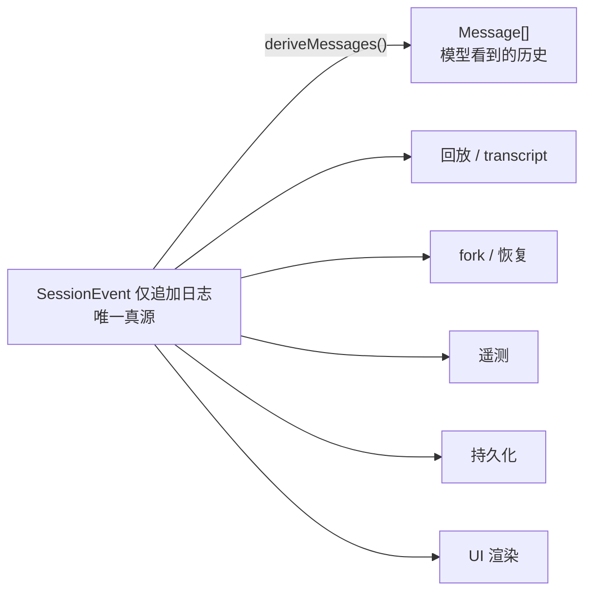

# 没记账就等于没发生

<div class="chapter-meta">
<span class="badge lv2">架构</span>
<span class="badge time">约 14 分钟</span>
<span class="badge">一条会被自动检查的硬规则</span>
</div>

<div class="goal">
<div class="goal-title">读完这章你会</div>
<ul>
<li>知道给 agent 加「模型可见的输入」时，最少要做什么</li>
<li>理解为什么有些事件<strong>记录了但不给模型看</strong></li>
<li>看懂崩溃恢复为什么<strong>不截断日志</strong>——一个很讲道理的设计</li>
</ul>
</div>

## 一个看起来很合理的做法

<div class="story">
<div class="line me"><div class="who">你</div><div class="says">我想让模型知道当前 git 分支。在 <code>agent/request</code> 里把它拼进消息就行了吧？</div></div>
<div class="line sys"><div class="who">运行时不变量</div><div class="says">拒绝。</div></div>
<div class="line me"><div class="who">你</div><div class="says">？功能是能跑的啊。</div></div>
<div class="line sys"><div class="who">运行时不变量</div><div class="says">能跑，但这条信息<strong>没进日志</strong>。于是回放这个会话时，模型看到的历史和当时不一样；fork 出来的子会话丢了这条上下文；transcript 也对不上。</div></div>
</div>

## 核心原则

<div class="callout key">
<span class="callout-title">模型可见 ⟺ 已记录</span>
抵达模型请求的<strong>一切</strong>都必须能从日志重建，<strong>并且由一项运行时不变量断言这一点</strong>。<br><br>
所以：新增一项模型可见输入 = <strong>必须</strong>新增一个会话事件（扩展 <code>SessionEventMap</code>，并从日志渲染它）。
</div>

这不是「建议」，是有自动检查的。仓库里有个 `ctx.invariants` 服务专门跑这类运行时不变式。

<div class="analogy">
<div class="analogy-title">记账</div>
会话日志是一本<strong>只能往后写、不能涂改</strong>的流水账。<br><br>
公司认账不认口头承诺：<strong>没记进账本的开支，报销时就是不存在。</strong> 同理，没进日志的上下文，回放时就是不存在。
</div>

## 日志是唯一真源

`Session` 是一份由类型化 `SessionEvent` 组成的**仅追加日志**。

> LLM 消息历史从日志**派生**而来，**从不单独存储**；回放即从同一组事件重新派生。



fork、恢复、transcript、遥测、持久化——**全都从这一条流派生**。这就是为什么它必须完整。

## 日志 → 模型历史的投影规则

`deriveMessages()` 把日志投影成模型看到的 `Message[]`。注意它**不是**简单地全部倒出来：

| 日志里的事件 | 投影成什么 |
|---|---|
| `user/message` | 一条 user 消息 |
| `assistant/message` | 一条 assistant 消息（带提供方和模型） |
| `assistant/chunk` | **跳过**——它是回放/UI 数据，组装后的消息才权威 |
| **内容为空的** `assistant/message` | **跳过** |
| `tool/result` | 一条带 `tool-result` 块的 user 消息 |
| `user/message`（注入的上下文） | 按时间顺序原位生成一条 user 消息 |
| `turn/*`、`step/*`、`llm/retry` | **不投影**——它们是结构信息 |

<div class="callout tip">
<span class="callout-title">「记录了但不给模型看」的典型</span>
因 max-tokens 截断、内容为空的那一步，<strong>仍然记一条</strong> <code>assistant/message</code>——为了保住<strong>用量、提供方、模型</strong>这些记账信息。但空的 assistant 轮次<strong>不能进提供方 transcript</strong>。<br><br>
所以同一个事件：<strong>进日志，不进历史</strong>。这两个概念一定要分开。
</div>

它还有两个性质值得知道：**缓存的**（每个 surface 节点首次出现时投影一次，重写才重建）、**冻结的**（每次返回新数组，引用共享的深冻结消息——所以「通过投影去改历史」在类型上就写不出来）。

<details class="deep">
<summary>deriveEventMessage 与 token 记账<span class="deep-tag">细节</span></summary>
<div class="deep-body">

`deriveEventMessage(event)` 是折叠时应用的**逐节点纯函数**，被公开导出。这样外部重建器和开发期不变式检查能用**完全相同的规则**投影日志前缀，不会和缓存产生分歧。

**token 记账**读每步的 `assistant/chunk { type: 'usage' }`；没有用量分片时，用 `assistant/message.usage` 作为已提交步骤的后备。

失败的模型请求**没有 assistant 消息**，所以它的用量分片本身就是那次记账记录——这就是为什么失败也要记 chunk。

</div>
</details>

## 事件类型可以扩展

`SessionEventMap` 通过**声明合并**扩展（[第 06 章](#/cordis-events)那个手法，用在包级别）：

| 插件 | 加了什么事件 |
|---|---|
| 压缩 seam | `compaction/start` / `compaction/summary` / `compaction/end` |
| `dsh-hook-protocol` | 仅记录日志的 `hook/invoked` / `hook/result` |

<div class="callout warn">
<span class="callout-title">默认是「读到就必须认识」</span>
一个 <code>SessionEventMap</code> 成员默认是 <strong>required-on-read</strong>——<strong>不认识这个类型的构建会拒绝整个日志</strong>，除非该事件带了 <code>ignorable: true</code>。<br><br>
只有<strong>结构性</strong>的格式变化才会 bump <code>SESSION_FORMAT_VERSION</code>。而那个版本号目前是 <strong>0</strong>，<strong>没有任何兼容承诺</strong>——后端 load 时遇到别的版本直接拒绝，不做迁移。
</div>

## 日志之外的元数据

不是所有东西都该进日志。格式版本、cwd、血统、seed 边界这些是**存储层关注点，不是对话事件**——它们放在 `SessionHeader` 里，通过 `session.header` 挂在 Session 上，**不进 `SessionEventMap`，也不会到达 `deriveMessages()`**。

判断标准：**这是对话的一部分，还是关于这次对话的元信息？**

## fork：从任意稳定点分叉

```ts
fork(source: SessionForkSource, boundary?: number, childSessionId?: SessionId): Session
```

- 选取到 `boundary` seq（**含**）为止的源事件，默认到当前最后一个
- **要求所选前缀结束时没有开放轮次**
- 创建活跃子会话，带深克隆的种子事件和子会话元数据（`parentSession`、`seedLength`、继承的 `cwd`）

<div class="callout key">
<span class="callout-title">拒绝，而不是静默截断</span>
如果你给的边界正好落在一个<strong>还没结束的轮次中间</strong>，API 会<strong>拒绝</strong>，而不是悄悄帮你截掉。<br><br>
又一次「fails loud」——静默截断会产出一个看起来正常、实则残缺的子会话，那比报错糟糕得多。
</div>

## 持久化是另一个插口

内存里的日志是真源，**怎么把它落盘**是独立的能力插口：`ctx.sessionPersistence`，两个可互换后端（**JSONL** 和 **SQLite**）。

关键设计：**没有平行的持久化事件类型**——插口直接在现有 `SessionEvent` 上定义 locate / create / append / load / inspect。

<details class="deep">
<summary>flush 检查点：不阻塞生产方的批量写<span class="deep-tag">进阶</span></summary>
<div class="deep-body">

`session/event` 是**同步**通知；持久化插件把事件复制到逐会话的控制器，**不阻塞生产方**。

- 第一个待处理事件开启一个固定的批处理窗口，后续事件加入但**不重置截止时间**
- 窗口到期启动一批写入；这期间新来的事件获得自己的截止时间，形成下一批
- `session/flush` 取消等待并排空到完全停稳——**循环用它作为「领取下一个普通轮次之前」的顺序与错误观察检查点**

后台写入被拒绝时：保留对应事件、暂停自动重试，通过 `agent/error` 和 logger 报告，**绝不会把失败记成「已关闭轮次之后的会话事件」**。

</div>
</details>

## 崩溃恢复为什么不截断

<div class="callout tip">
<span class="callout-title">一个很讲道理的设计</span>
后端重新加载「轮次中途崩溃」的日志时，会看到一个有 <code>turn/start</code> 却没有 <code>turn/end</code> 的开放轮次。<br><br>
它<strong>不截断</strong>。因为在长任务里，单个轮次可能非常庞大（几十个步骤、大量工具输出），而<strong>这些事件在崩溃前已经真的持久化了</strong>——扔掉它们等于毁掉几个小时的工作。<br><br>
它的做法是补一个合成的 <code>turn/end { reason: { kind: 'interrupted' } }</code> 把这个遗留轮次配平。<code>interrupted</code> 是<strong>唯一一个不由循环发出的</strong> <code>TurnEndReason</code>。
</div>

而且这个修复**只对冷会话生效**。对活跃 id，`load(id)` 会等权威内存快照落盘，只在日志平衡时返回；活跃轮次还没闭合就**拒绝**，而不是加合成边界。

<div class="quiz">
<div class="quiz-q">你要给 agent 加一个新的模型可见输入（比如注入当前 git 分支）。最少要做什么？</div>
<button class="quiz-opt">在 <code>agent/request</code> 里直接拼进消息</button>
<button class="quiz-opt" data-answer="yes">扩展 <code>SessionEventMap</code> 加一个会话事件，并从日志渲染它</button>
<button class="quiz-opt">写进 <code>SessionHeader</code></button>
<div class="quiz-why">「模型可见 ⟺ 已记录」是有运行时不变量断言的硬规则。直接拼消息会让这个输入<strong>无法从日志重建</strong>，回放和 fork 就失真了。<code>SessionHeader</code> 也不行——它是存储层元数据，<strong>根本不会到达 <code>deriveMessages()</code></strong>。</div>
</div>

<div class="recap">
<div class="recap-title">带走这三句</div>
<ul>
<li><strong>日志是唯一真源</strong>，模型历史是<em>派生</em>出来的，不单独存储。</li>
<li><strong>「进日志」和「进模型历史」是两件事</strong>——空的 assistant 消息进前者不进后者。</li>
<li><strong>加模型可见输入必须加会话事件</strong>，这条有自动检查，绕不过去。</li>
</ul>
</div>

<div class="pathline">
<a href="#/arch-turn">10 一个回合</a>
<span class="sep">→</span>
<span class="now">11 没记账就等于没发生</span>
<span class="sep">→</span>
<a href="#/arch-tools">12 一次工具调用的安检</a>
<span class="sep">→</span>
<span>13 换灯泡</span>
</div>
