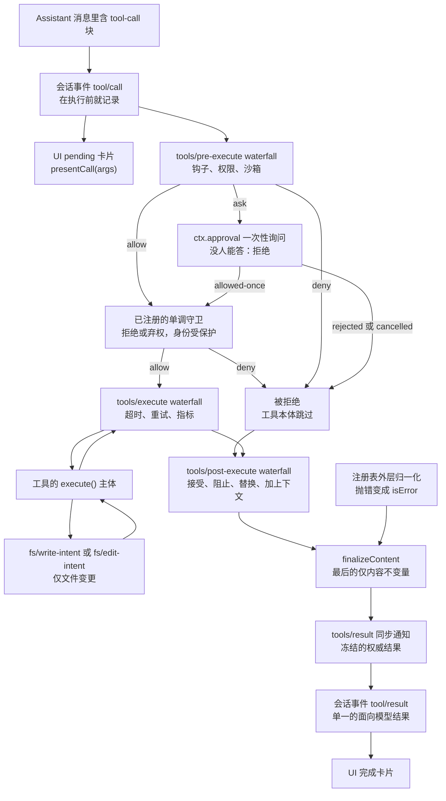

# 一次工具调用的安检

<div class="chapter-meta">
<span class="badge lv2">架构</span>
<span class="badge time">约 16 分钟</span>
<span class="badge">写工具前必读</span>
</div>

<div class="goal">
<div class="goal-title">读完这章你会</div>
<ul>
<li>知道权限、超时、沙箱这些策略各自该挂在哪一环</li>
<li>写出一个合格的工具定义，并避开三个常见错误</li>
<li>理解为什么<strong>不该</strong>把策略写进工具本身</li>
</ul>
</div>

## 先明确一件事

<div class="story">
<div class="line me"><div class="who">你</div><div class="says">我这个工具要加权限确认，在 <code>execute()</code> 开头弹个框问一下？</div></div>
<div class="line sys"><div class="who">规约</div><div class="says">别。你下一个工具也要问，再下一个也要问——最后每个工具里都有一份权限代码，还各写各的。</div></div>
<div class="line me"><div class="who">你</div><div class="says">那放哪？</div></div>
<div class="line sys"><div class="who">规约</div><div class="says">流水线上。工具只管「做这件事」，<strong>要不要做</strong>是别人的职责。</div></div>
</div>

<div class="analogy">
<div class="analogy-title">机场安检</div>
登机口不负责查危险品——<strong>安检通道</strong>负责。这样新开一个登机口，不用重新实现一遍安检。<br><br>
dsh 的工具调用要过<strong>三道关卡</strong>，策略挂在关卡上，工具本身只是终点的那扇门。
</div>

## 三道关卡

```
tools/pre-execute  →  单调守卫  →  tools/execute  →  【工具本体】  →  tools/post-execute
   (waterfall)      (不可翻案)     (环绕分发)                          (waterfall)
```

这三个 waterfall **都能改写一次调用**。之后还有工具定义自己控制的 `finalizeContent` 和 `tools/result`。

## 各关卡分工

写策略时对着这张表选：

| 挂在哪 | 用来做什么 |
|---|---|
| `tools/pre-execute` | **允许 / 拒绝 / 询问**策略，钩子、权限、沙箱 |
| `ctx.tools.guard()` | **最终的单调拒绝**，后续监听器<strong>无法翻案</strong> |
| `tools/execute` | 给分发加**截止时间、重试、指标** |
| `tools/post-execute` | 替换展示内容或返回值、阻止结果、追加模型可见上下文 |
| `tools/result` | **只能观察**冻结的最终结果，**不能改** |

<div class="callout key">
<span class="callout-title">pre-execute 和 guard 的区别</span>
两个都能拒绝，但性质不同：<br><br>
<code>tools/pre-execute</code> 是 waterfall——<strong>你的决定可能被后注册的监听器包装掉</strong>。<br>
<code>ctx.tools.guard()</code> 是<strong>单调</strong>的：只能拒绝或弃权，<strong>没有「允许」这个返回值</strong>。所以一旦有守卫说不行，<strong>没有任何监听器能把它翻回允许</strong>。<br><br>
要「最终否决权」就用 guard，别用 pre-execute。
</div>

## 完整流程图



<div class="callout key">
<span class="callout-title">注意 tool/call 的位置</span>
它在<strong>执行之前</strong>就记录了。所以「模型请求过这次调用」这个事实，无论后面是被拒、超时还是成功，<strong>都已经在日志里</strong>了——又一次呼应<a href="#/arch-session">上一章</a>的记账原则。
</div>

## 写一个工具

```ts
import { readFile } from 'node:fs/promises'
import type { Context } from '@deepseek-ai/cordis'
import { defineTool } from '@deepseek-ai/dsh-tools'

export const name = 'my-tool'
export const inject = ['tools']

export function apply(ctx: Context) {
  ctx.tools.register(defineTool({
    name: 'read_file',
    description: 'Read a file from disk.',          // ← 模型看到的
    parameters: {
      path: { type: 'string', required: true, description: 'Absolute path' },
      limit: { type: 'number' },                     // 默认可选
    },
    output: {
      schema: { type: 'string' },
      render: (_args, value) => [{ type: 'text', text: value }],
    },
    async execute(args, exec) {
      // args 从 schema 推导出了类型：{ path: string; limit?: number }
      return readFile(args.path, { encoding: 'utf8', signal: exec.signal })
    },
  }))
}
```

两个自动发生的好事：**注册是 effect**（dispose 插件即注销工具），**schema 自动流入系统提示词组装**（不用手动加）。

## execute() 的约定

| 规则 | 说明 |
|---|---|
| **参数已经替你校验过了** | 类型、必填、字面量约束、联合、嵌套值都查过。但 schema 表达不了的（非空字符串、正数、跨字段规则）还得自己查 |
| **返回规范 JSON 值，不要返回内容块** | 注册表会快照、校验、冻结，再交给 `output.render(args, value)` |
| **抛异常或返回无效值 = `isError`** | 基础设施故障就抛；**成功但结果不理想**（比如进程非零退出）应该写进规范值 |
| **遵守 `exec.signal`** | 信号触发就取消 |
| **`args` 当只读** | `callId`、`name`、`arguments`、`agent`、`token`、`signal` 全程不可变 |

<div class="callout tip">
<span class="callout-title">「返回值」和「给模型看的内容」是两回事</span>
<code>execute</code> 返回<strong>规范值</strong>（结构化 JSON），<code>output.render</code> 把它转成模型看到的文字。<br><br>
为什么分开？因为 <strong>Code Mode</strong> 下模型可以 <code>await tools.read_file({...})</code> 直接拿到规范值——这时它要的是结构化数据，不是一段自然语言。所以：<strong>把 <code>output.schema</code> 设计成好用的程序化 API</strong>，直接返回句柄和字段，别逼调用方去解析文字。
</div>

## 三个常见错误

<div class="versus">
<div class="bad">
<div class="vs-head">把策略写进工具</div>
<div class="vs-body">

```ts
async execute(args, exec) {
  if (!await askUser()) throw ...   // 权限
  return withTimeout(30_000, work)  // 超时
}
```

</div>
<div class="vs-note">每个工具都要重写一遍</div>
</div>
<div class="good">
<div class="vs-head">挂在流水线上</div>
<div class="vs-body">

```ts
// 权限：tools/pre-execute 返回 ask
// 超时：tools/execute 包装 signal
// 工具本体只管干活
async execute(args, exec) {
  return work(args, exec.signal)
}
```

</div>
<div class="vs-note">一次实现，所有工具受益</div>
</div>
</div>

其余两个错误在下面的折叠块里。

<details class="deep">
<summary>错误二：在展示方法里做 I/O<span class="deep-tag">写 UI 卡片时必看</span></summary>
<div class="deep-body">

工具的 UI 卡片通过 `presentCall(args)` / `presentResult(args, result)` 声明，返回一个 **`card` 标签的渲染意图**：

| card | 什么时候用 | 字段 |
|---|---|---|
| `generic` | 默认 | `{ title, kind?, rawInput?, content?, locations? }` |
| `terminal` | 调用本身就是 shell 命令 | `{ title, description?, cwd? }` |
| `diff` | 调用创建或修改文件 | `{ title, diffs, locations? }`，新文件 `oldText: null` |

**硬纪律：这些方法必须是纯函数。** 它们在实时流式输出**和会话日志回放时都会跑**——回放时那个文件可能早就不存在了。

原文说得很直白：

> 如果你发现自己想在 `presentCall` 内获取文件旧内容或工作目录，**请停下**：那属于持久结果元数据或适配器，不属于展示器。

配套的还有一条：**UI 格式不进入模型结果**。围栏 ` ```console ` 块、diff、相对化路径都不该仅为了服务 UI 而进入规范值。

</div>
</details>

<details class="deep">
<summary>错误三：后台任务用错了取消信号<span class="deep-tag">写长任务时必看</span></summary>
<div class="deep-body">

长任务用 `ctx.jobs.start({ kind, label, owner: exec.agent, run })` 注册。

**坑在这里**：`ctx.jobs.start()` 发布 id 之后，应该用**任务自有的取消信号**，而不是 `exec.signal`。

因为之后取消外层调用，只会停止「等待这次调用」，**不会终止已经发布出去的后台工作**——那个生命周期归 `job_kill`、owner dispose 和服务 teardown 管。

前台工作则仍然与 `exec.signal` 耦合。

</div>
</details>

## 结果是怎么定稿的

顺序有讲究：

1. 注册表对候选结果做**无损快照**
2. 快照失败 → 先把失败**归一化**成 `isError`
3. 然后 `finalizeContent` 强制它那条「仅限内容」的不变量
4. `tools/result` 观察**不可变、可无损 JSON 表示**的最终结果

<div class="callout key">
<span class="callout-title">这套设计换来了什么</span>
原文点明了：「这样一来，钩子便可跨越不同工具系列，而<strong>无需让工具与某个策略服务耦合</strong>。」<br><br>
工具不 import 权限服务，权限服务不 import 工具——两边都只认流水线事件。这是 <a href="#/arch-seams">seam 思想</a>在工具层的体现。
</div>

<div class="quiz">
<div class="quiz-q">你要给所有工具加「30 秒超时」。挂哪？</div>
<button class="quiz-opt">每个工具的 <code>execute()</code> 里加 <code>Promise.race</code></button>
<button class="quiz-opt" data-answer="yes"><code>tools/execute</code> waterfall，替换 <code>exec.signal</code> 施加截止时间</button>
<button class="quiz-opt"><code>tools/result</code> 里检查耗时</button>
<div class="quiz-why"><code>tools/execute</code> 是<strong>环绕分发</strong>，专门承载超时、重试、指标。而且只有它的包装器能<strong>替换并恢复</strong> <code>exec.signal</code>（但不能移除）。仓库的 <code>packages/guard/</code> 里就有一个这样的截止时间执行器。<code>tools/result</code> 太晚——它只能看，不能改。</div>
</div>

<div class="recap">
<div class="recap-title">带走这三句</div>
<ul>
<li><strong>工具只管做事，策略挂流水线</strong>——权限走 pre-execute，超时走 execute，最终否决走 guard。</li>
<li><strong>规范值 ≠ 给模型看的文字</strong>，前者是程序化 API，后者是 <code>output.render</code>。</li>
<li><strong>展示方法必须纯</strong>，因为回放时它还会再跑一遍。</li>
</ul>
</div>

<div class="pathline">
<a href="#/arch-session">11 记账</a>
<span class="sep">→</span>
<span class="now">12 一次工具调用的安检</span>
<span class="sep">→</span>
<a href="#/arch-seams">13 换灯泡不用换电线</a>
<span class="sep">→</span>
<span>动手实践</span>
</div>
