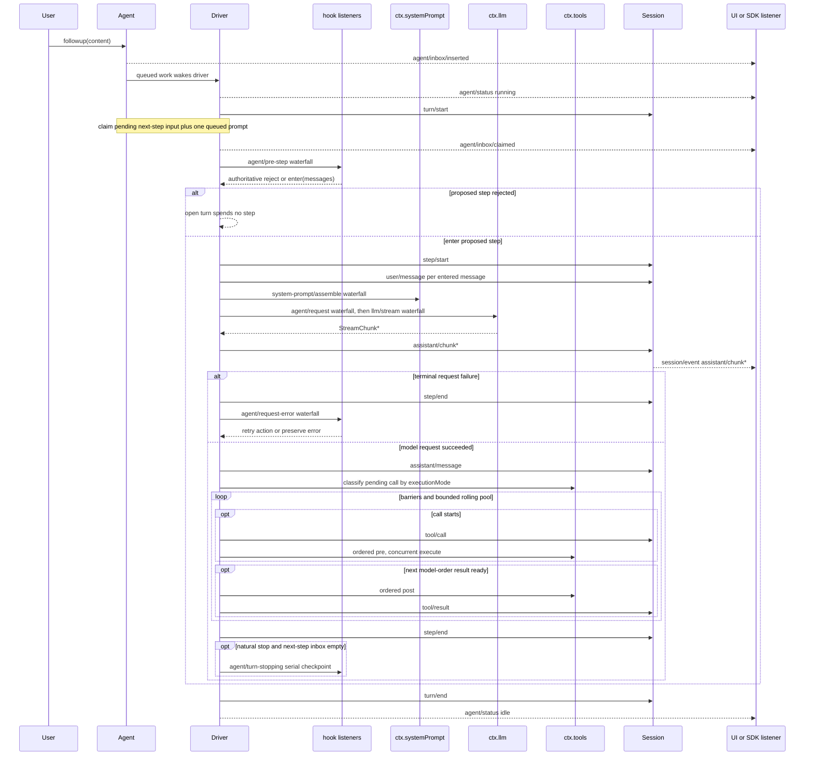

# 模型的一个回合

<div class="chapter-meta">
<span class="badge lv3">硬核</span>
<span class="badge time">约 18 分钟</span>
<span class="badge">全站技术密度最高</span>
</div>

<div class="goal">
<div class="goal-title">读完这章你会</div>
<ul>
<li>说清楚 agent 从「收到消息」到「停下来」中间发生了什么</li>
<li>知道想拦截某件事时，该挂在哪一环</li>
<li>理解一个反直觉的事实：<strong>有的轮次一次模型都不调</strong></li>
</ul>
</div>

## 两个词，别搞混

<div class="analogy">
<div class="analogy-title">开会</div>
<strong>轮次（turn）</strong> = 一次完整的会议。从「有人提了个事」开始，到「没有待办了」结束。<br>
<strong>步骤（step）</strong> = 会上的一次发言 + 随之而来的执行。<br><br>
一次会议可以有<strong>好几轮</strong>发言（模型调了工具，拿到结果又要再说一次）——也可以<strong>一次发言都没有</strong>（开场就被叫停了）。
</div>

正式定义：

| 词 | 定义 |
|---|---|
| **步骤（step）** | **一次模型请求，加上它调用的工具** |
| **轮次（turn）** | 包含**零个或多个**步骤。领取首条输入之前打开，不再欠任何工作时关闭 |

术语表里还有第三个词：<span class="term" data-def="Round：承载一个轮次的外层策略迭代，比如一个 Goal Round，或一次使用全新 agent 的 Ralph 尝试。Round 计数器归策略所有，不统计会话里的每个轮次。">Round</span>——那是更外层的策略概念，[术语表](#/ref-glossary)里讲。

## 全景流程

先看骨架，下面逐段拆：

```text
turn/start
  领取 next-step 输入，外加一条排队的消息
  组装提示词片段 + 工具 schema
  -> agent/pre-step                   拒绝 | 放行(messages)
     被拒绝，或首次放行被改写成空 -> 关闭轮次，不花费任何步骤
     step/start
     把放行的消息追加为 user/message
     从日志派生模型历史
     agent/request -> llm/stream -> assistant/chunk* -> assistant/message
     tool/call* -> tools/pre-execute -> tools/execute -> tools/post-execute -> tool/result*
     step/end
     工具还欠一次请求，或又来了新输入 -> 继续领取 -> 下一个步骤
  -> agent/turn-stopping
turn/end
```

## 谁是持久的，谁是临时的

这个区分极其重要——它决定了你写的东西重启后还在不在：

<div class="versus">
<div class="good">
<div class="vs-head">持久会话事件（进日志）</div>
<div class="vs-body">
<p><code>turn/*</code><br>
<code>step/*</code><br>
<code>user/message</code><br>
<code>assistant/*</code><br>
<code>tool/*</code></p>
</div>
<div class="vs-note">重启后能重建，可回放</div>
</div>
<div class="bad">
<div class="vs-head">实时扩展点（不进日志）</div>
<div class="vs-body">
<p><code>agent/pre-step</code>&nbsp;&nbsp;waterfall<br>
<code>agent/request</code>&nbsp;&nbsp;waterfall<br>
<code>llm/stream</code>&nbsp;&nbsp;waterfall<br>
<code>tools/pre-execute</code>&nbsp;&nbsp;waterfall<br>
<code>tools/execute</code>&nbsp;&nbsp;waterfall<br>
<code>tools/post-execute</code>&nbsp;&nbsp;waterfall<br>
<code>agent/turn-stopping</code>&nbsp;&nbsp;<strong>serial</strong></p>
</div>
<div class="vs-note">进程停了就没了</div>
</div>
</div>

<div class="callout warn">
<span class="callout-title">六个 waterfall，一个 serial</span>
前六个都是 waterfall——<strong>监听器必须调 <code>next()</code> 才能往下委托</strong>（<a href="#/cordis-events">第 06 章</a>那条铁律，这里是它最集中的应用场景）。<br><br>
但 <code>agent/turn-stopping</code> 是 <strong>serial</strong>，<strong>没有 <code>next()</code></strong>。别照着 waterfall 的写法写它。
</div>

## 逐段拆解

### 输入是怎么进来的

所有输入都经过同一个 **inbox**，但行为分两种：

- **有些消息立刻唤醒驱动器** —— 用户发的 followup
- **注入的上下文留在 inbox 里** —— 直到别的消息把它唤醒

这解释了 `agent.inject()` 的语义：它**不会自己触发一个轮次**，只是「落到下一次获准的请求里」。

### agent/pre-step：决定模型看到什么

这是最重要的拦截点：

> 监听器可以**改写**已领取的消息，也可以直接**拒绝**它们。

<div class="callout key">
<span class="callout-title">那个反直觉的事实</span>
「首次领取被拒绝或被改写为空时，<strong>仍会关闭一个不含步骤的持久轮次</strong>，因此日志会记录这次尝试。」<br><br>
也就是说：<strong>拒绝一次输入 ≠ 什么都没发生</strong>。轮次照开照关，日志里留下这次尝试的痕迹。<br><br>
这就是「轮次包含<em>零个</em>或多个步骤」那句定义的来源，也是[下一章](#/arch-session)「模型可见即已记录」原则的一个体现——连被拒绝的尝试都是可回放的事实。
</div>

规则还有一条：**以返回的决策为准**。包装了 `next()` 的监听器会保留下游消息，除非它有意替换。steering（中途插话）和注入的上下文，在后续领取时会经过**同一个** waterfall。

### 模型请求与流式输出

```
agent/request  ->  llm/stream  ->  assistant/chunk*  ->  assistant/message
```

`agent/request` 让插件替换调用配置，`llm/stream` 包装流式过程，每个流式分片记一条 `assistant/chunk`，最后组装成 `assistant/message`。

<details class="deep">
<summary>为什么空的 assistant 消息也要记录<span class="deep-tag">细节</span></summary>
<div class="deep-body">

> `assistant/message` 事件会记录**每次成功的提供方调用**，包括返回空内容或以 `max-tokens` 结束的调用。空内容不会进入派生历史，但该持久事件仍会保留用量，并通过 `sourceEventSeqs` 精确列出对应的 `assistant/chunk` 事件，包括显式空列表。

翻译：「模型这次返回了空」**本身也是要记的事实**——为了用量统计和回放保真。但它不会污染送给模型的历史。

这是「持久事实」和「模型历史」两个概念分离的最好例子：同一个事件，**记录了但不投影**。

</div>
</details>

### 工具执行

```
Driver->>Tools: 按 executionMode 给待执行调用分类
loop 屏障 + 有界滚动池，启动前重新分类
```

要点三个：按 `executionMode` 分类；用**屏障 + 有界滚动池**调度；**启动前会重新分类**。

结果按**模型顺序（model-order）**记录——所以并发执行不会让模型看到乱序的结果。细节在[下一章的工具流水线](#/arch-tools)。

## 完整时序图

上面拆完了，现在看全图（可以横向滚动）：



## 上下文满了怎么办

`dsh-compaction-basic` 有两个介入点：

| 路径 | 时机 |
|---|---|
| `agent/pre-step` | 在派生请求**之前**处理压力 |
| `agent/request-error` | **仅**用于规范的上下文溢出 |

任一触发后，先做可选的**工具结果剪枝**，再选**摘要**。恢复发生在**失败步骤结束之后、失败轮次结束之前**。

<div class="callout warn">
<span class="callout-title">一个防死循环的设计</span>
只有当剪枝或摘要<strong>真的推进了 surface replacement generation</strong> 时，才会开启一个全新的重试轮次；<strong>否则仍以原始请求错误为准</strong>。<br><br>
道理很朴素：如果压缩没能真的腾出空间，就别假装还能重试——那样只会无限循环。
</div>

## 写 UI 或 SDK 时该听哪个

<div class="callout tip">
<span class="callout-title">一条实用的分工规则</span>
需要<strong>可回放的 transcript 数据</strong> → 消费 <code>session/event</code>。<br>
需要<strong>实时协调</strong>（队列状态、提示词拦截、请求构造、steering、继续执行、错误处理）→ 用 <code>agent/*</code>。
</div>

<div class="quiz">
<div class="quiz-q">一个 <code>agent/pre-step</code> 监听器拒绝了这次输入。会话日志里会留下什么？</div>
<button class="quiz-opt">什么都没有，因为没发生模型请求</button>
<button class="quiz-opt" data-answer="yes"><code>turn/start</code> 和 <code>turn/end</code>，但没有 <code>step/*</code></button>
<button class="quiz-opt">只有一条错误事件</button>
<div class="quiz-why">「首次领取被拒绝或被改写为空时，<strong>仍会关闭一个不含步骤的持久轮次</strong>。」这就是「轮次包含<em>零个</em>或多个步骤」的实际来源——被拒绝的尝试也是要留档的事实。</div>
</div>

<div class="recap">
<div class="recap-title">带走这三句</div>
<ul>
<li><strong>轮次 = 一次会议，步骤 = 一次发言</strong>，一次会议可以零次发言。</li>
<li><strong>持久的进日志，实时的只在内存</strong>——挂扩展点前先想清楚要哪种。</li>
<li><strong><code>agent/pre-step</code> 决定模型看到什么</strong>，是最重要的拦截点；它是 waterfall，别忘了 <code>next()</code>。</li>
</ul>
</div>

<div class="pathline">
<a href="#/arch-overview">09 一棵树</a>
<span class="sep">→</span>
<span class="now">10 模型的一个回合</span>
<span class="sep">→</span>
<a href="#/arch-session">11 没记账就等于没发生</a>
<span class="sep">→</span>
<span>12 安检</span>
</div>
