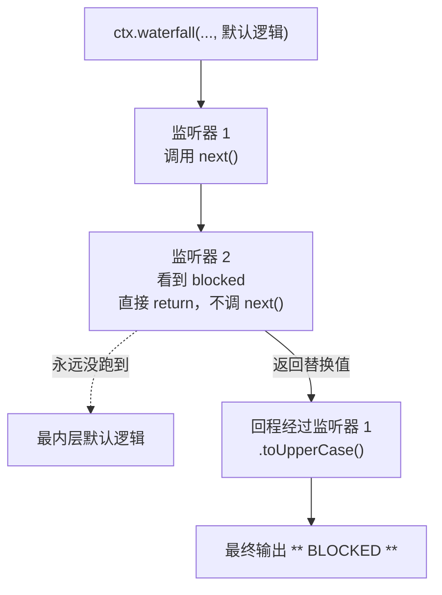

# 广播、审批与套娃

<div class="chapter-meta">
<span class="badge lv2">核心</span>
<span class="badge time">约 16 分钟</span>
<span class="badge lv3">含头号大坑</span>
</div>

<div class="goal">
<div class="goal-title">读完这章你会</div>
<ul>
<li>声明并发出自己的类型化事件</li>
<li>分清五种分发模式，知道什么时候用哪个</li>
<li><strong>永远不再踩</strong>那个「加个日志把功能搞挂」的坑</li>
</ul>
</div>

## 服务不够用的时候

服务解决「我要调用某个能力」。但还有另一类需求：

<div class="story">
<div class="line me"><div class="who">你</div><div class="says">我想在每次工具执行完之后记一笔账。</div></div>
<div class="line sys"><div class="who">问题</div><div class="says">工具注册表<strong>不认识</strong>你的记账插件。难道要在它代码里加一行 <code>callBilling()</code>？</div></div>
<div class="line me"><div class="who">你</div><div class="says">那下次再来一个审计插件呢？再加一行？</div></div>
<div class="line sys"><div class="who">答案</div><div class="says">发事件。发出方<strong>不需要知道谁在听</strong>，听的人自己注册。</div></div>
</div>

<div class="analogy">
<div class="analogy-title">公司版</div>
服务是<strong>打电话找人办事</strong>——你得知道找谁。<br>
事件是<strong>发公告</strong>——贴出去，关心的人自己来看，你不需要有收件人名单。
</div>

## 声明、发出、监听

```ts
import { Service, type Context } from '@deepseek-ai/cordis'

declare module '@deepseek-ai/cordis' {
  interface Context {
    stats: StatsService
  }
  interface Events {
    'stats/report'(name: string, count: number): void    // ← 声明事件名和签名
  }
}

export class StatsService extends Service {
  private counts = new Map<string, number>()

  constructor(ctx: Context) {
    super(ctx, 'stats')
  }

  bump(name: string) {
    const next = (this.counts.get(name) ?? 0) + 1
    this.counts.set(name, next)
    this.ctx.emit('stats/report', name, next)          // ← 发公告
  }
}

export const name = 'stats'
export function apply(ctx: Context) {
  ctx.plugin(StatsService)
}
```

注意 `interface Events` 的合并和上一章 `interface Context` 的合并是**同一手法的两个用法**：一个声明「岗位在 ctx 上的位置」，一个声明「事件名和监听器签名」。有了它，`emit` 和 `on` 都有完整类型。

命名约定是 `namespace/action`——`stats/report`、`tool/call`、`agent/pre-step` 都是这个形状，让扁平的事件命名空间保持可读。

监听方：

```ts
import type { Context } from '@deepseek-ai/cordis'
import type {} from './stats.ts'          // ← 这行很重要，见下

export const name = 'reporter'
export const inject = ['stats']

export function apply(ctx: Context) {
  ctx.on('stats/report', (name, count) => {
    console.log(`[stats] ${name} -> ${count}`)
  })
  ctx.stats.bump('tool_call')
  ctx.stats.bump('tool_call')
  ctx.stats.bump('prompt')
}
```

```
[stats] tool_call -> 1
[stats] tool_call -> 2
[stats] prompt -> 1
```

<div class="callout key">
<span class="callout-title">那行空 import 不是笔误</span>
<code>import type {} from './stats.ts'</code> —— 大括号里什么都没有，<strong>运行时也不导入任何东西</strong>。<br><br>
它唯一的作用是让 TypeScript 看到那个文件里的<strong>声明合并</strong>。删掉它，<code>'stats/report'</code> 就没类型了。<br><br>
跨包时同理：<code>import type {} from '@deepseek-ai/dsh-tools'</code>。以后在 harness 代码里看到这种空 import，就知道是在引入事件类型。
</div>

监听器是 effect，随插件一起消失，**不需要 `removeListener`**。

## 五种分发模式

| 模式 | 怎么调 | 干什么 | 公司版 |
|---|---|---|---|
| `emit` | `ctx.emit(name, ...args)` | 同步广播，不等待、不收集返回值 | 群发通知 |
| `parallel` | `await ctx.parallel(...)` | 所有监听器并发跑，一起等完 | 并行会签 |
| `serial` | `await ctx.serial(...)` | 按序跑，**第一个非空返回值胜出**并终止后续 | 挨个问，谁先给答案就用谁的 |
| `bail` | `ctx.bail(...)` | `serial` 的同步版 | 同上，不用等 |
| `waterfall` | `ctx.waterfall(..., next)` | 环绕中间件 | **逐级审批** |

**一个事件只能用它自己那种方式分发。** 模式是事件公开约定的一部分，harness 里每个事件都用 `@mode` JSDoc 标签声明，生成的目录会把「声明」和「实际调用点」交叉校验。

## 头号大坑：waterfall

前四种都很直白。第五种是 harness 的主力，也是**新人 100% 会踩的坑**。

### 先看它能干什么

每个监听器收到参数和一个 `next()`。它有两个选择：

```ts
declare module '@deepseek-ai/cordis' {
  interface Events {
    'demo/transform'(input: string, next: () => Promise<string>): Promise<string>
  }
}

export function apply(ctx: Context) {
  // 监听器 1：包装下游的结果
  ctx.on('demo/transform', async (input, next) => {
    const downstream = await next()
    return downstream.toUpperCase()
  })

  // 监听器 2：拥有决策权时，直接拍板
  ctx.on('demo/transform', async (input, next) => {
    if (input.includes('blocked')) return '** blocked **'   // 不调 next
    return next()
  })

  void (async () => {
    console.log(await ctx.waterfall('demo/transform', 'hello', async () => 'hello'))
    console.log(await ctx.waterfall('demo/transform', 'blocked words', async () => 'blocked words'))
  })()
}
```

输出：

```
HELLO
** BLOCKED **
```

### 第二行是怎么来的



监听器 2 短路了，**最内层的默认逻辑压根没执行**；但返回途中还是经过了监听器 1，被转成了大写。

<div class="analogy">
<div class="analogy-title">俄罗斯套娃 / 逐级审批</div>
文件从最外层往里递，再从里往外传回来。每一层都有两次机会：<strong>递进去之前改一改</strong>，<strong>传出来之后再改一改</strong>。<br><br>
或者干脆<strong>不往里递</strong>，自己签字决定——里面的人永远不知道有过这份文件。
</div>

### 坑在哪

<div class="versus">
<div class="bad">
<div class="vs-head">我只想加个日志</div>
<div class="vs-body">

```ts
ctx.on('tools/pre-execute', (exec) => {
  console.log(exec.name)
})
```

<p>日志有了。<strong>然后所有工具都不执行了。</strong></p>
</div>
<div class="vs-note">没有任何报错</div>
</div>
<div class="good">
<div class="vs-head">正确写法</div>
<div class="vs-body">

```ts
ctx.on('tools/pre-execute', (exec, next) => {
  console.log(exec.name)
  return next()
})
```

<p>日志有了，链条继续往下走。</p>
</div>
<div class="vs-note">差别就是一个 next()</div>
</div>
</div>

<div class="callout warn">
<span class="callout-title">这是仓库的常设规则</span>
<strong>只负责观察或标注的 waterfall 监听器，必须调用 <code>next()</code>。</strong> 不调用就直接返回，等于<em>有意</em>短路。<br><br>
一个忘了 <code>next()</code> 的日志监听器，会<strong>静默吞掉所有下游行为</strong>——包括权限检查、沙箱、以及工具本体。没有报错，没有警告，功能就是不工作了。
</div>

反过来说：**对于单决策事件，短路正是设计意图**。策略监听器在自己有决定权时就该直接返回。

判断标准一句话：**我是在做决定，还是在旁观？** 旁观就必须 `next()`。

<details class="deep">
<summary>prepend 和「谁先谁后」<span class="deep-tag">进阶</span></summary>
<div class="deep-body">

监听器按**注册顺序**排在链上。需要在普通注册之前插队时，用 `prepend: true`——**仅在必须时使用**。

协作式的监听器通常是「修改一个共享的请求或决策对象，然后委托下去」。也可以选择完全替换结果，那样下游监听器只会看到替换后的版本。

</div>
</details>

## harness 里的 waterfall 清单

看完这张表，你就知道 waterfall 为什么是主力模式了——**几乎所有"可以被策略拦截或改写"的地方都是它**：

| 事件 | 能干什么 |
|---|---|
| `agent/pre-step` | 决定模型看到什么；可改写消息，也可直接拒绝 |
| `agent/request` | 替换模型调用配置 |
| `llm/stream` | 包装流式输出 |
| `tools/pre-execute` | 钩子、权限、沙箱 |
| `tools/execute` | 环绕分发：超时、重试、指标 |
| `tools/post-execute` | 接受、阻止、替换结果、追加上下文 |
| `approval/request` | 策略代替用户作答 |

<div class="quiz">
<div class="quiz-q">你写了个 <code>tools/pre-execute</code> 监听器只打印日志，签名是 <code>(exec) => { console.log(exec.name) }</code>。会怎样？</div>
<button class="quiz-opt">正常打印，工具照常执行</button>
<button class="quiz-opt" data-answer="yes">日志打印了，但所有工具都不再执行</button>
<button class="quiz-opt">类型检查会拒绝这段代码</button>
<div class="quiz-why">没调 <code>next()</code> = <strong>短路整条链</strong>。权限检查、沙箱、工具本体全都不跑，而且不报错。正确写法是 <code>(exec, next) => { console.log(exec.name); return next() }</code>。这就是本章开头预告的那个坑——现在你已经免疫了。</div>
</div>

<div class="recap">
<div class="recap-title">带走这三句</div>
<ul>
<li><strong>服务是打电话，事件是发公告</strong>——发出方不需要知道谁在听。</li>
<li><strong>模式是约定的一部分</strong>，一个事件只能用它自己那种方式分发。</li>
<li><strong>waterfall 里，「只看一眼」和「我驳回」长得一模一样</strong>——区别只有那句 <code>next()</code>。</li>
</ul>
</div>

<div class="pathline">
<a href="#/cordis-service">05 认岗不认人</a>
<span class="sep">→</span>
<span class="now">06 广播与套娃</span>
<span class="sep">→</span>
<a href="#/cordis-config">07 填错表退回</a>
<span class="sep">→</span>
<span>08 改组织</span>
</div>
