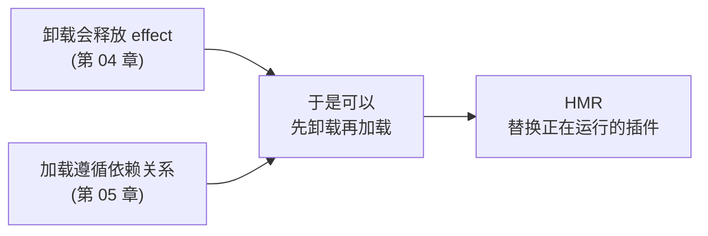

# 改组织不用重启公司

<div class="chapter-meta">
<span class="badge lv2">核心</span>
<span class="badge time">约 14 分钟</span>
<span class="badge">Cordis 收官</span>
</div>

<div class="goal">
<div class="goal-title">读完这章你会</div>
<ul>
<li>让两组插件各用一份互不干扰的同名服务</li>
<li>跑通热重载，看着 effect 自动回卷</li>
<li>拿到一段<strong>排查神器</strong>：把所有「等在门口」的插件揪出来</li>
</ul>
</div>

## 一个真实需求

<div class="story">
<div class="line me"><div class="who">你</div><div class="says">我想让「快速任务」用 5 秒超时的 Bash，「构建任务」用 60 秒的。</div></div>
<div class="line sys"><div class="who">问题</div><div class="says">但 <code>ctx.shell</code> 是<strong>一个岗位</strong>，全应用只有一个人坐着。怎么让两拨人看到不同的人？</div></div>
<div class="line sys"><div class="who">答案</div><div class="says">分组 + <code>isolate</code>。给每个组配一个<strong>自己的</strong> shell 岗。</div></div>
</div>

## 组与隔离

```yaml
- id: group-a
  name: '@deepseek-ai/cordis-plugin-group'
  group: true
  isolate:
    shell: true                              # ← 这个组有自己的 shell 岗
  config:
    - name: '@deepseek-ai/dsh-bash-local'
      config:
        timeoutMs: 5000
    - name: './src/plugin-a.ts'

- id: group-b
  name: '@deepseek-ai/cordis-plugin-group'
  group: true
  isolate:
    shell: true                              # ← 另一个独立的 shell 岗
  config:
    - name: '@deepseek-ai/dsh-bash-local'
      config:
        timeoutMs: 60000
    - name: './src/plugin-b.ts'
```

`plugin-a` 和 `plugin-b` 各自看到自己组内的 Bash 实例，互不影响。两边代码都写 `inject: ['shell']`，**谁也不知道自己用的是哪一个**。

<div class="analogy">
<div class="analogy-title">公司版</div>
总部有一个「运维」岗。现在成立两个事业部，各自配<strong>自己的运维</strong>。<br><br>
两边员工的工作流程一个字都不用改——他们还是「找运维」，只不过找到的是本部门那位。
</div>

组还有个基础用途：**把一批配置项当成一个单元加载和卸载**。

<div class="callout key">
<span class="callout-title">这个机制在 harness 里的真实用途</span>
架构文档里有一行：「让某个会话拥有不同的能力集合 → 组装一个 agent preset；<strong>其中的服务行需要 <code>isolate</code> realm</strong>。」<br><br>
也就是说，<strong>每个会话拥有不同能力</strong>这个产品功能，底层就是组 + <code>isolate</code>。
</div>

## 热重载

推导链条很直接：



`@deepseek-ai/cordis-plugin-hmr` 监视文件，保存时自动做这件事：

```yaml
- id: logger
  name: '@deepseek-ai/cordis-plugin-logger-console'
- id: timer
  name: '@deepseek-ai/cordis-plugin-timer'
- id: hmr
  name: '@deepseek-ai/cordis-plugin-hmr'
  config:
    root: ['.']
- id: hello
  name: './hello.ts'
```

<div class="callout warn">
<span class="callout-title">那两个辅助插件不是装饰</span>
<strong><code>logger-console</code></strong>：HMR 通过 Cordis 的 logger 服务打日志。<strong>没有它，你看不到 HMR 的任何消息</strong>，会以为它没工作。<br><br>
<strong><code>timer</code></strong>：HMR <code>inject</code> 了 <code>timer</code> 来做去抖。<strong>没有它，HMR 永远停在 PENDING</strong>，而且不发出任何提示。<br><br>
这就是活生生的 PENDING 陷阱——功能没坏，只是永远没启动。
</div>

<div class="try">
<div class="try-title">跑起来，然后改一行代码保存</div>

```sh
node --import tsx ../../vendor/cordis/bin.js
```

```
hello from my first plugin
2026-07-22 15:44:36 [I] hmr watching [ '.' ]
2026-07-22 15:44:39 [I] hmr reload plugin at hello.ts
hello from my EDITED plugin
```

旧实例先卸载（**所有 effect 回卷**），新代码加载，`apply` 再跑一次。
</div>

改 `cordis.yml` 本身也会触发更新：loader **按 `id` 比对**，只动发生变化的部分。

这就是[第 03 章](#/cordis-plugin)说「该显式写 `id`」的实际后果——不带 `id` 的项每次读取都拿到新 id，于是你动配置文件任何一个字，它都会被当成「删掉 + 新增」重新挂载一遍。

## 排查神器

现在解决那个反复出现的问题：**插件毫无反应，怎么查？**

因为 PENDING 不是错误（提供方可能晚点才来），Cordis 不会主动提醒你。但状态是可以直接查的——每个上下文都能枚举插件注册表：

```ts
import { FiberState, type Context } from '@deepseek-ai/cordis'

export const name = 'diagnose'

export function apply(ctx: Context) {
  setTimeout(() => {
    for (const runtime of ctx.registry.values()) {
      for (const fiber of runtime.fibers) {
        if (fiber.state === FiberState.PENDING) {
          console.log(`${fiber.name} is PENDING — a required service is missing`)
        }
      }
    }
  }, 500)
}
```

<div class="try">
<div class="try-title">造一个查无此人的场景</div>

`needs-timer.ts`：

```ts
export const name = 'needs-timer'
export const inject = ['timer']          // 没人提供 timer

export function apply(ctx: Context) {
  console.log('needs-timer loaded')      // 永远不会打印
}
```

```yaml
- name: './needs-timer.ts'
- name: './diagnose.ts'
```

```
needs-timer is PENDING — a required service is missing
```

加上 `- name: '@deepseek-ai/cordis-plugin-timer'`，`needs-timer loaded` 就出现了。
</div>

<div class="callout tip">
<span class="callout-title">把这段代码存起来</span>
以后任何「插件不干活也不报错」的情况，第一件事就是把 <code>diagnose.ts</code> 加进 cordis.yml。<br><br>
顺带一提：去掉 PENDING 过滤再跑一次，你会看到 loader 自己的插件（Loader、Include）处于 ACTIVE——因为<strong>配置文件本身也是靠插件挂载的</strong>。这个项目是真的「一切皆插件」。
</div>

## Cordis 部分小结

六章走完了。检验一下——这些问题你现在应该都能答：

| 问题 | 答案 |
|---|---|
| 插件怎么写 | 导出 `apply(ctx)`（或对象 / `Service` 子类） |
| 谁来组装 | `cordis.yml` 清单，**顺序无关** |
| 怎么共享能力 | 服务占 `ctx.<key>`，消费方 `inject` |
| 怎么松耦合通信 | 类型化事件 + 声明合并，五种分发 |
| 怎么接受配置 | 同名双导出 `Config`（接口 + schema） |
| 怎么清理资源 | `ctx.effect()`；内置注册 API 已经是 effect |
| 插件没反应怎么查 | 枚举 `ctx.registry`，找 PENDING |

<div class="quiz">
<div class="quiz-q">你加了 HMR 插件，但没加 timer 插件。HMR 会怎样？</div>
<button class="quiz-opt">正常工作，只是去抖失效</button>
<button class="quiz-opt">启动时报错说缺少 timer</button>
<button class="quiz-opt" data-answer="yes">永远停在 PENDING，不发出任何提示</button>
<div class="quiz-why">HMR <code>inject</code> 了 <code>timer</code>——硬依赖缺失就保持 PENDING，<strong>没有任何提示</strong>，看起来就像 HMR 不好使。官方教程专门把这个例子放进来，因为它是最典型的 PENDING 现场。</div>
</div>

<div class="recap">
<div class="recap-title">带走这三句</div>
<ul>
<li><strong><code>isolate</code> 让同一个岗位名有多个独立实例</strong>——per-session 能力差异就是这么做的。</li>
<li><strong>HMR = 卸载 + 加载</strong>，能成立全靠前面两章的 effect 回卷和依赖驱动。</li>
<li><strong>没反应先查 fiber 状态</strong>，PENDING 是合法的，所以它不会主动告诉你。</li>
</ul>
</div>

<div class="pathline">
<a href="#/cordis-config">07 填错表退回</a>
<span class="sep">→</span>
<span class="now">08 改组织不用重启</span>
<span class="sep">→</span>
<a href="#/arch-overview">09 一棵树怎么长出来</a>
<span class="sep">→</span>
<span>Harness 架构</span>
</div>
