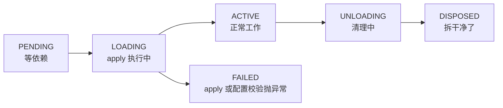

# 离职要交工牌

<div class="chapter-meta">
<span class="badge lv1">基础</span>
<span class="badge time">约 12 分钟</span>
<span class="badge">可跟着敲</span>
</div>

<div class="goal">
<div class="goal-title">读完这章你会</div>
<ul>
<li>知道什么东西必须包进 <code>ctx.effect()</code>，什么不用</li>
<li>看懂插件的六种状态，特别是那个「查无此人」的 PENDING</li>
<li>避开一个会在热重载时慢慢泄漏的坑</li>
</ul>
</div>

## 先看事故

<div class="story">
<div class="story-scene">你写了一个每秒上报一次的插件</div>
<div class="line me"><div class="who">你</div><div class="says"><code>const timer = setInterval(report, 1000)</code>，很简单啊。</div></div>
<div class="line sys"><div class="who">半小时后</div><div class="says">你改了几次代码，每次保存触发热重载。现在有 <strong>17 个定时器</strong>同时在跑。</div></div>
<div class="line me"><div class="who">你</div><div class="says">？？我只创建了一个。</div></div>
<div class="line sys"><div class="who">真相</div><div class="says">你创建了 17 次。热重载会卸载旧实例、装载新实例——但 Cordis <strong>只能撤销它知道的东西</strong>。裸 <code>setInterval</code> 它不知道。</div></div>
</div>

<div class="analogy">
<div class="analogy-title">公司版</div>
员工入职领了工牌、门禁卡、笔记本电脑。<strong>离职时必须交还</strong>。<br><br>
Cordis 帮你自动回收<strong>它经手发出去的东西</strong>（监听器、服务、子插件）。但如果你自己在外面配了一把钥匙，它不知道，也就收不回来——你走了，钥匙还在外面。
</div>

## 正确姿势：ctx.effect()

规则很干脆：**Cordis 还没管的资源，包进 `ctx.effect()`，返回一个清理函数。**

```ts
import type { Context } from '@deepseek-ai/cordis'

export const name = 'lifecycle-demo'

function heartbeat(ctx: Context) {
  console.log('heartbeat plugin loading')
  ctx.effect(() => {
    const timer = setInterval(() => console.log('tick'), 200)
    return () => {                      // ← 卸载时会跑这个
      clearInterval(timer)
      console.log('heartbeat cleaned up')
    }
  })
}

export function apply(ctx: Context) {
  // 挂载子插件，留着它的 fiber 以便稍后释放
  const fiber = ctx.plugin(heartbeat)

  // 这个 setTimeout 本身也是 effect：
  // 万一本插件先被卸载，这个待执行的回调会被取消，
  // 而不是在一个已经死掉的 app 上触发。
  ctx.effect(() => {
    const timer = setTimeout(async () => {
      await fiber.dispose()
      console.log('disposed')
      process.exit(0)
    }, 700)
    return () => clearTimeout(timer)
  })
}
```

<div class="try">
<div class="try-title">跑一下，注意输出顺序</div>

```
heartbeat plugin loading
tick
tick
tick
heartbeat cleaned up      ← 清理先完成
disposed                  ← 然后 dispose() 才返回
```

`fiber.dispose()` 会**等所有清理工作完成**（包括异步的）才结束，并且**递归**卸载它挂载的所有子插件。
</div>

<div class="callout key">
<span class="callout-title">留意上面那个「多余」的 effect</span>
连 <code>setTimeout</code> 都包进了 <code>ctx.effect()</code>。为什么？<br><br>
因为如果外层插件先被卸载，那个待执行的回调会被<strong>取消</strong>，而不是在一个已经拆掉的应用上触发。这是仓库的防御式编程习惯（<code>docs/defensive-patterns.md</code> 专门讲这类模式，动生命周期/并发/子进程代码前建议先读）。
</div>

## 哪些已经是 effect 了

好消息：大部分时候你不用自己写 `ctx.effect()`，因为内置的注册 API 本身就是 effect。

| 你写的 | 卸载时自动发生 |
|---|---|
| `ctx.on(event, listener)` | 监听器移除 |
| `ctx.plugin(child)` | 子插件一起 dispose |
| 服务注册 | 服务摘除 |
| `ctx.tools.register(...)` 等 harness 注册表 | 返回的 disposer 附着到你的插件上，自动撤销 |

所以：**永远不需要手写 `removeListener`**。

需要你操心的只有：定时器、网络连接、文件 watcher、外部进程——这些 Cordis 不经手的东西。

## 插件的六种状态

每个已加载的插件实例都有一个 <span class="term" data-def="fiber：一个已加载插件实例的运行时句柄。同一个插件可以被挂载多次，每次得到一个独立的 fiber。">fiber</span>：



| 状态 | 含义 | 公司版 |
|---|---|---|
| **PENDING** | 依赖的服务还不存在 | 在门口等同事到岗 |
| **LOADING** | `apply` 正在跑 | 办入职手续 |
| **ACTIVE** | `apply` 完成 | 正常上班 |
| **FAILED** | `apply` 或配置校验抛了异常 | 入职当场失败 |
| **UNLOADING** | 清理函数正在跑 | 交接中 |
| **DISPOSED** | 全部拆完 | 已离职 |

<div class="callout warn">
<span class="callout-title">PENDING 是你未来最常遇到的状态</span>
它<strong>不是错误</strong>，是合法状态——依赖可能晚点才挂载。代价是：插件停在这里时，<strong>不报错、不输出、什么都没有</strong>。<br><br>
「为什么我的插件毫无反应」，答案十有八九是 PENDING。<a href="#/cordis-hmr">第 08 章</a>给你一段代码，专门把这些等在门口的插件揪出来。
</div>

## 一个会坑到你的顺序问题

<details class="deep">
<summary>多个异步 disposer 是并发跑的<span class="deep-tag">写 provider 时会遇到</span></summary>
<div class="deep-body">

disposer 按注册顺序的**逆序**启动——这符合直觉。但是：

**多个异步 disposer 会并发运行。**

假设你要「先关连接池，再关底层 socket」，分成两个 effect 写：

```ts
ctx.effect(() => () => closeSocket())    // 先注册
ctx.effect(() => () => closePool())      // 后注册 → 先启动
```

逆序启动没错，但两个都是 async，于是它们**同时在跑**——socket 可能在连接池还没排空时就关掉了。

正确做法是放进**同一个 disposer**，在里面依次 await：

```ts
ctx.effect(() => () => async () => {
  await closePool()
  await closeSocket()
})
```

规则：**有顺序要求的拆解步骤，必须放在一个 effect 里。**

</div>
</details>

## 这一切是为了什么

回到[第 02 章](#/mental-model)那条推论链。「注册可撤销」这一条，撑起了三件事：

1. **热重载真能用** —— 先卸载（effect 全部回卷）再装载，[第 08 章](#/cordis-hmr)会实际跑一次
2. **依赖消失时能安全连坐** —— 依赖的服务没了，消费方跟着卸载，不会留下持有失效引用的僵尸监听器
3. **配置里能换 provider** —— 换掉一个实现，所有用它的插件重启并接上新的

<div class="quiz">
<div class="quiz-q">插件里写了裸的 <code>const timer = setInterval(tick, 1000)</code>，没包 effect。热重载之后？</div>
<button class="quiz-opt">Cordis 会自动清理所有定时器</button>
<button class="quiz-opt" data-answer="yes">旧定时器继续跑，新实例又建一个，越积越多</button>
<button class="quiz-opt">重载会失败并报错</button>
<div class="quiz-why">Cordis 只能撤销<strong>它知道的</strong>注册。裸 <code>setInterval</code> 不在其中——它没经过 <code>ctx</code>。这就是本章开头那个「17 个定时器」事故。HMR 场景下泄漏累积得特别快，因为你每存一次盘就漏一个。</div>
</div>

<div class="recap">
<div class="recap-title">带走这三句</div>
<ul>
<li><strong>Cordis 经手的自动回收</strong>（<code>ctx.on</code>、<code>ctx.plugin</code>、各种 <code>register</code>），你不用管。</li>
<li><strong>它没经手的自己包</strong>——定时器、连接、watcher，进 <code>ctx.effect()</code>。</li>
<li><strong>有顺序要求的清理放同一个 effect 里</strong>，因为异步 disposer 之间是并发的。</li>
</ul>
</div>

<div class="pathline">
<a href="#/cordis-plugin">03 写一个员工</a>
<span class="sep">→</span>
<span class="now">04 交工牌</span>
<span class="sep">→</span>
<a href="#/cordis-service">05 认岗不认人</a>
<span class="sep">→</span>
<span>06 广播与套娃</span>
</div>
