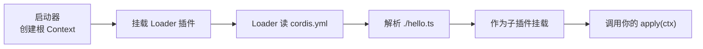

# 写一个「员工」

<div class="chapter-meta">
<span class="badge lv1">基础</span>
<span class="badge time">约 12 分钟</span>
<span class="badge">可跟着敲</span>
</div>

<div class="goal">
<div class="goal-title">读完这章你会</div>
<ul>
<li>写出能跑的最小插件，并知道它凭什么能跑</li>
<li>分清<strong>两种失败方式</strong>——一种炸得很响，一种悄无声息</li>
<li>知道为什么配置文件里的顺序<strong>不是</strong>加载顺序</li>
</ul>
</div>

## 最小的那个

一个插件就是一个导出 `apply` 的模块。Cordis 加载它时，会递给它一个 `ctx`：

```ts
import type { Context } from '@deepseek-ai/cordis'

export const name = 'hello'

export function apply(ctx: Context) {
  console.log('hello from my first plugin')
}
```

就这些。`name` 是可选的，只用于诊断信息里认人。

<div class="analogy">
<div class="analogy-title">公司版</div>
<code>apply</code> 就是<strong>入职第一天做的事</strong>。<code>ctx</code> 是发给你的那套东西——通讯录、门禁、公告板。你要贡献的一切，都通过它登记。
</div>

## 谁来组装

插件自己不知道该在什么时候跑。**组装是配置文件的事**：

```yaml
- name: './hello.ts'
```

这就是一份清单，每项 `name` 是一个模块指定符——相对路径或 NPM 包名都行。

```sh
node --import tsx ../../vendor/cordis/bin.js
```

```
hello from my first plugin
```

发生了什么：



<div class="callout key">
<span class="callout-title">注意你的文件里没有的东西</span>
没有 <code>main()</code>，没有框架初始化，没有「注册到某个全局对象」。<strong>插件描述自己的贡献，YAML 组合应用。</strong><br><br>
<code>dsh</code> 真正的 base 层（<code>packages/bundle/base/cordis.patch.yml</code>）就是一份长得多的同类清单。你现在写的和它是同一种东西，只是短一点。
</div>

跑完之后进程会自己退出——**没有任何东西还在运行了**。

## 陷阱：列表顺序 ≠ 加载顺序

这条第一次看会觉得反直觉：

<div class="story">
<div class="line me"><div class="who">你</div><div class="says">我把 A 写在 B 前面，那肯定 A 先加载吧？</div></div>
<div class="line sys"><div class="who">Cordis</div><div class="says">不。各配置项<strong>并发启动</strong>，谁先跑完不一定。真正决定顺序的是 <code>inject</code> 声明的依赖关系。</div></div>
<div class="line me"><div class="who">你</div><div class="says">那我想控制顺序怎么办？</div></div>
<div class="line sys"><div class="who">Cordis</div><div class="says">用依赖表达它。「我需要 X 就绪」比「请把我排在第三位」更准确，也更不容易在别人改配置时坏掉。</div></div>
</div>

[第 05 章](#/cordis-service)你会亲手验证这一点：交换两行顺序，输出完全不变。

## 两种失败，区别很重要

这是本章最值钱的部分。插件挂掉有两种方式，**表现完全不同**：

<div class="versus">
<div class="bad">
<div class="vs-head">情况一：apply 里抛异常</div>
<div class="vs-body">

```ts
export function apply(ctx: Context) {
  throw new Error('apply exploded')
}
```

<p><strong>进程直接终止。</strong></p>
</div>
<div class="vs-note">加载失败会明确报错，不会偷偷跳过</div>
</div>
<div class="bad">
<div class="vs-head">情况二：模块路径拼错</div>
<div class="vs-body">

```yaml
- name: './my-plugn.ts'   # 少个 i
```

<p><strong>进程正常运行，什么也没发生。</strong></p>
</div>
<div class="vs-note">而且报错可能你根本看不见</div>
</div>
</div>

<div class="callout warn">
<span class="callout-title">第二种是真的会浪费你半小时</span>
模块无法<strong>解析</strong>时，Cordis 通过 logger 服务报告错误，<strong>不会让进程崩溃</strong>。更要命的是：在启动早期，这条报告可能在 console 导出器开始工作<strong>之前</strong>就发出了，于是彻底消失。<br><br>
所以记住这条经验法则：<strong>新加的配置项好像完全没生效？先检查拼写。</strong>
</div>

## 插件的三种形态

```ts
import { Service, type Context } from '@deepseek-ai/cordis'

// 1. 函数插件 —— 刚才写的那种
export function apply(ctx: Context) {}

// 2. 对象插件 —— 带 apply 方法的对象
export const objectPlugin = {
  name: 'object-plugin',
  apply(ctx: Context) {},
}

// 3. 类插件 —— Service 子类
export class MyService extends Service {
  constructor(ctx: Context) {
    super(ctx, 'myTutorialService')
  }
}
```

选择规则一句话：**在你需要对外提供服务之前，一直用函数形态。**

<details class="deep">
<summary>对象形态和类形态的完整写法<span class="deep-tag">用到再看</span></summary>
<div class="deep-body">

对象形态，`inject` 是同级字段：

```ts
export default {
  name: 'my-plugin',
  inject: ['tools'],
  apply(ctx: Context) {
    // ...
  },
}
```

类形态用 `static inject`：

```ts
export default class MyService extends Service {
  static inject = ['tools']

  constructor(ctx: Context) {
    super(ctx, 'myService')
    // 同步初始化放构造函数里
  }
}
```

<strong>注意别混用形态。</strong> 仓库规约里有一条：服务包默认导出服务类；函数插件用具名导出 `name` / `inject` / `Config` / `apply`，<strong>不要有默认导出</strong>。混着写会让 Loader 丢掉函数插件的命名空间——仓库里有一份专门的事故记录（`docs/postmortem/0001-acp-default-export-drops-inject.md`）。

</div>
</details>

## 配置项还能带什么

除了 `name` 和 `config`：

```yaml
- id: greeter          # 这个配置项的稳定身份
  name: './greeter.ts'
- id: consumer
  name: './consumer.ts'
  disabled: true       # 留着这一项，但不挂载
```

- **`id`** 让 loader 能区分「改了现有项」和「删掉再新增」。
- **`disabled: true`** 卸载插件但保留配置项。改回去，它以及所有因它而 PENDING 的插件都会重新加载。

<div class="callout tip">
<span class="callout-title">为什么该显式写 id</span>
不带 <code>id</code> 的配置项，<strong>每次读取都会拿到一个新生成的 id</strong>。于是你只要动了配置文件任何一个字，即使这一项自己没变，它也会被当成「删除 + 新增」而重新挂载一遍。<br><br>
做热重载（<a href="#/cordis-hmr">第 08 章</a>）时这个差别非常明显。
</div>

<div class="quiz">
<div class="quiz-q">你在 cordis.yml 加了一行，但文件名拼错了。运行后会怎样？</div>
<button class="quiz-opt">进程崩溃并打印路径错误</button>
<button class="quiz-opt" data-answer="yes">进程正常跑，错误报告可能完全看不到</button>
<button class="quiz-opt">Loader 自动模糊匹配文件名</button>
<div class="quiz-why">模块<strong>解析</strong>失败走 logger 服务，不崩进程；启动早期这条报告还可能在 console 导出器就位前就丢了。这和 <code>apply</code> 内部抛异常（进程终止）是两条完全不同的失败路径——分清它们能省下很多排查时间。</div>
</div>

<div class="recap">
<div class="recap-title">带走这三句</div>
<ul>
<li>插件 = 导出 <code>apply(ctx)</code> 的模块，<strong>没有框架样板代码</strong>。</li>
<li>清单里的顺序不是加载顺序，<strong>依赖才是</strong>。</li>
<li><code>apply</code> 抛异常会炸得很响；<strong>路径拼错静悄悄</strong>——没反应就先查拼写。</li>
</ul>
</div>

<div class="pathline">
<a href="#/mental-model">02 心智模型</a>
<span class="sep">→</span>
<span class="now">03 写一个员工</span>
<span class="sep">→</span>
<a href="#/cordis-lifecycle">04 交工牌</a>
<span class="sep">→</span>
<span>05 认岗不认人</span>
</div>
