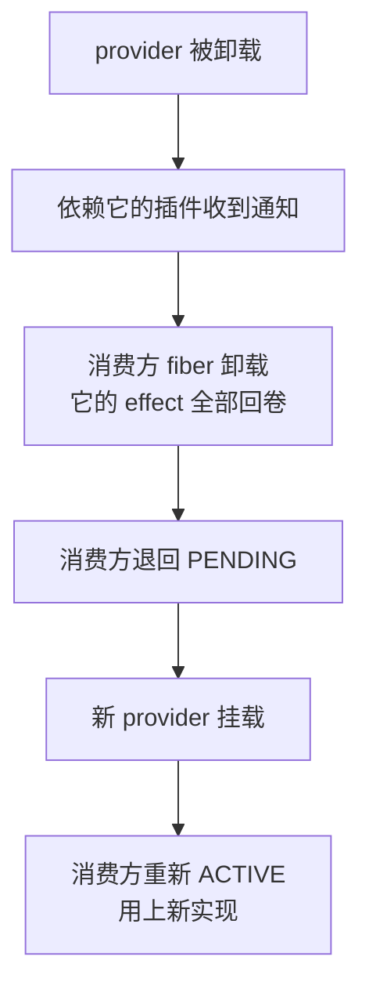

# 认岗不认人

<div class="chapter-meta">
<span class="badge lv2">核心</span>
<span class="badge time">约 14 分钟</span>
<span class="badge">整个架构的支点</span>
</div>

<div class="goal">
<div class="goal-title">读完这章你会</div>
<ul>
<li>写出一个能被别人用的服务，并让它有类型提示</li>
<li>亲手验证「配置文件顺序无关」</li>
<li>理解为什么<strong>换 provider 不用改任何调用方代码</strong>——这是全书最有迁移价值的一点</li>
</ul>
</div>

## 服务是什么

<div class="analogy">
<div class="analogy-title">岗位与人</div>
<code>ctx.shell</code> 是<strong>岗位</strong>，<code>dsh-bash-local</code> 是<strong>现在坐在这个岗位上的人</strong>。<br><br>
你的代码写「找运维」，不写「找张三」。张三离职换李四，你的代码一个字都不用改——<strong>因为它从来就不知道张三</strong>。
</div>

在 harness 里，`ctx.tools`、`ctx.llm`、`ctx.agents` 都是这样的岗位。

## 开一个岗位

```ts
import { Service, type Context } from '@deepseek-ai/cordis'

declare module '@deepseek-ai/cordis' {
  interface Context {
    greeter: GreeterService
  }
}

export class GreeterService extends Service {
  constructor(ctx: Context) {
    super(ctx, 'greeter')          // ← 岗位名叫 greeter
  }

  greet(who: string) {
    return `Hello, ${who}!`
  }
}

export const name = 'greeter'

export function apply(ctx: Context) {
  ctx.plugin(GreeterService)
}
```

这段代码有**两个互相独立的层面**，分清它们能省很多困惑：

| 层面 | 谁负责 | 干了什么 |
|---|---|---|
| **运行时** | `super(ctx, 'greeter')` | 真的把这个实例挂到 `greeter` 这个名字上。这是 effect——卸载时岗位就空了 |
| **编译期** | `declare module` 块 | 告诉 TypeScript「`ctx.greeter` 是这个类型」。**不生成任何代码** |

<div class="callout key">
<span class="callout-title">试试删掉 declare module 块</span>
服务<strong>在运行时照常工作</strong>，只是消费方写 <code>ctx.greeter</code> 时没有类型提示、编译器会报「属性不存在」。<br><br>
这证明两层真的是独立的：<span class="term" data-def="TypeScript 的 declare module 机制，给一个已存在的接口追加成员。多个文件可以各自往同一个接口里加东西，最后合并成一个。">声明合并</span>纯粹是给编译器看的。
</div>

`Service` 子类本身就是插件（[第 03 章](#/cordis-plugin)的类形态），所以 `ctx.plugin(GreeterService)` 和挂载别的插件没区别。

## 用这个岗位

```ts
import type { Context } from '@deepseek-ai/cordis'

export const name = 'consumer'
export const inject = ['greeter']       // ← 入职条件

export function apply(ctx: Context) {
  console.log(ctx.greeter.greet('world'))
}
```

`inject` 一列出来，Cordis 就**让这个插件停在 PENDING，直到列出的每个服务都存在**。

所以 `apply` 里可以直接用 `ctx.greeter`——**不需要写 `if (ctx.greeter)` 这种防御代码**。它一定在。

## 亲手验证三件事

<div class="try">
<div class="try-title">实验 A：交换顺序</div>

```yaml
- name: './greeter.ts'
- name: './consumer.ts'
```

输出 `Hello, world!`。现在把两行**对调**再跑一次。

**输出完全一样。** 决定启动时机的是依赖关系，不是文件里的行号。
</div>

<div class="try">
<div class="try-title">实验 B：把 greeter 那行删掉</div>

只留 `consumer.ts`。结果：

```
（什么都没有，进程以状态码 0 退出）
```

消费方停在 PENDING。**既不崩溃，也不报错，也不"只执行一半"。**
</div>

<div class="callout warn">
<span class="callout-title">为什么会「静默成功」退出</span>
PENDING 的 fiber <strong>不会让 Node 的事件循环保持活跃</strong>。于是如果组合里没有别的在跑的东西，进程就正常退出了，状态码还是 <strong>0</strong>。<br><br>
看起来就像「跑完了，没问题」——实际上你的插件一行都没执行。这个坑值得记住。
</div>

## 依赖不是一次性检查

这条让「换 provider」从「重启才行」变成「运行时随时能换」：

> `inject` 并非一次性的启动检查。如果应用运行期间所需服务消失（提供方被卸载或热替换），**每个依赖插件也会随之卸载**，并在服务恢复后**再次加载**。



配合[上一章](#/cordis-lifecycle)的 effect 回卷，效果是：**依赖消失时，消费方自己的注册也一并撤销**——不会留下一个持有失效引用的僵尸。

<div class="callout key">
<span class="callout-title">这就是「改一行 YAML 换掉实现」的完整机制</span>
卸载 <code>dsh-bash-local</code>，挂载另一个 shell 提供方 → 所有 <code>inject: ['shell']</code> 的插件自动重启，接上新实现。<br><br>
它们的<strong>代码一个字都不用改</strong>，因为它们从来只认识 <code>ctx.shell</code> 这个名字。
</div>

## 硬依赖 vs 可选依赖

`inject` 是**硬依赖**：没有就不启动。

如果缺了某个功能你还能干活，就别 `inject`，改成在使用处探测：

```ts
export function apply(ctx: Context) {
  // 没有提供方时是 undefined；插件照样运行
  const greeter = ctx.get('greeter')
  console.log(greeter?.greet('maybe') ?? 'no greeter available')
}
```

判断标准一句话：**缺了它我还能干活吗？** 能 → `ctx.get()`；不能 → `inject`。

<details class="deep">
<summary>为什么可选依赖必须用 ctx.get() 而不是 ctx.xxx<span class="deep-tag">仓库规约</span></summary>
<div class="deep-body">

`packages/AGENTS.md` 里有一条：

> **Optional services use `ctx.get(name)`.** Reserve `ctx.<name>` for declared injections; the property proxy is topology-sensitive, while strict `ctx.get` reads the global service store.

翻译：`ctx.<name>` 这个属性代理是**拓扑敏感**的——它的解析结果跟你在插件树里的位置有关。而 `ctx.get()` 严格读全局服务存储。

所以：**声明过 `inject` 的用 `ctx.<name>`，没声明的一律用 `ctx.get()`。** 混用会踩到和上面那份 postmortem 同源的坑。

</div>
</details>

## 起名字要小心

<div class="callout warn">
<span class="callout-title">服务名是全局扁平命名空间</span>
整个应用里，所有服务名<strong>共用一个平面</strong>。没有包前缀、没有作用域隔离。<br><br>
所以给自己的服务起<strong>有辨识度的名字</strong>——<code>tools</code>、<code>llm</code> 这种通用词 harness 已经占了。子系统文档里自动生成的 <code>cordis-surface</code> 区块列出了 harness 注册的每一个名字。
</div>

## harness 里都有哪些岗位

先混个脸熟，[第 13 章](#/arch-seams)会给完整清单：

| `ctx` 键 | 岗位职责 |
|---|---|
| `ctx.sessions` | 会话日志（只能追加） |
| `ctx.systemPrompt` | 组装提示词和工具 schema |
| `ctx.tools` | 工具注册表 + 执行流水线 |
| `ctx.agents` | 活跃 agent 注册表 |
| `ctx.agentLoop` | 主循环驱动器 |
| `ctx.llm` | 模型适配器注册表 |
| `ctx.shell` | Bash 执行 |
| `ctx.fs` | 文件系统 |
| `ctx.approval` | 审批（问用户要不要放行） |
| `ctx.jobs` | 后台任务 |

<div class="quiz">
<div class="quiz-q">插件 B 用 <code>inject: ['greeter']</code>。运行中 greeter 提供方被热替换成另一个实现。B 会怎样？</div>
<button class="quiz-opt">继续持有旧实例的引用</button>
<button class="quiz-opt" data-answer="yes">先卸载（effect 回卷），新 provider 就绪后重新加载</button>
<button class="quiz-opt">不受影响，直到手动重启</button>
<div class="quiz-why">依赖跟踪在加载<strong>之后依然有效</strong>。这条 + 「注册是可撤销 effect」，共同保证了不会有插件持有失效引用——也正是配置层能替换实现的技术前提。</div>
</div>

<div class="recap">
<div class="recap-title">带走这三句</div>
<ul>
<li><strong>服务 = 岗位</strong>。代码按 <code>ctx.key</code> 找人，永远不 import 具体实现。</li>
<li><strong><code>inject</code> 保证就绪</strong>，所以 <code>apply</code> 里不用做存在性检查；缺了就静默 PENDING。</li>
<li><strong>依赖是持续跟踪的</strong>，服务消失消费方跟着卸载——这就是热替换 provider 的底层机制。</li>
</ul>
</div>

<div class="pathline">
<a href="#/cordis-lifecycle">04 交工牌</a>
<span class="sep">→</span>
<span class="now">05 认岗不认人</span>
<span class="sep">→</span>
<a href="#/cordis-events">06 广播与套娃</a>
<span class="sep">→</span>
<span>07 填错表退回</span>
</div>
