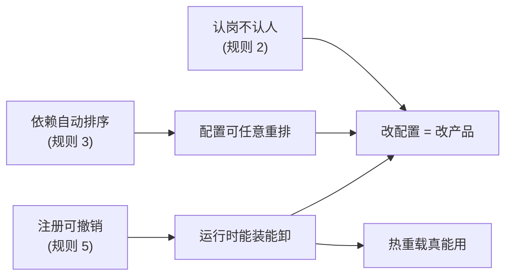

# 把它想成一家公司

<div class="chapter-meta">
<span class="badge lv1">入门</span>
<span class="badge time">约 10 分钟</span>
<span class="badge">全站最重要的一章</span>
</div>

<div class="goal">
<div class="goal-title">读完这章你会</div>
<ul>
<li>拿到一个能装下整个框架的类比，后面每一章都靠它</li>
<li>理解为什么「改一行 YAML 能换掉主循环」不是吹牛</li>
<li>提前认识那个让所有新人栽跟头的坑</li>
</ul>
</div>

## 一个问题

你要写一段代码，它需要执行 shell 命令。最朴素的写法：

```ts
import { runBash } from './bash-local.ts'   // 直接 import 具体实现

const result = await runBash('ls -la')
```

这段代码有个隐藏的承诺：**它永远在本地机器上执行**。想换成远程沙箱？改这个文件。有十个这样的文件？改十个。

Cordis 的做法是把这句 `import` 换成一句「找人」：

```ts
export const inject = ['shell']              // 我需要「shell」这个岗位有人

export function apply(ctx) {
  const result = await ctx.shell.run('ls -la')   // 找那个岗位上的人干活
}
```

差别看着不大，但性质完全变了：**这段代码不再知道是谁在执行命令。**

## 那个类比

<div class="analogy">
<div class="analogy-title">整个框架 = 一家公司</div>
Cordis 干的事情，本质上是<strong>人事系统</strong>：定义岗位、招人上岗、管理入职离职、安排协作。

| Cordis 里的东西 | 公司里对应什么 |
|---|---|
| **插件** | 一名员工 |
| **`ctx.shell`**（服务名） | 一个**岗位**，比如「运维」 |
| **服务** | 现在坐在那个岗位上的<strong>具体的人</strong> |
| **`inject: ['shell']`** | 入职条件：「运维岗有人我才能开工」 |
| **PENDING** | 在门口等着，那个同事还没入职 |
| **effect** | 入职领的工牌门禁，<strong>离职必须交还</strong> |
| **事件** | 内部广播 / 审批流 |
| **`cordis.yml`** | 花名册：这次开张要哪些岗、招谁 |

</div>

这个类比会贯穿全站。每次遇到抽象术语，都可以先翻译成公司里的事。

## 五条核心规则

现在把类比对回官方说法。这五条是 Cordis 的全部核心：

<div class="callout key">
<span class="callout-title">1. 插件是实现 Service 的对象</span>
可以是带 <code>apply(ctx)</code> 的<strong>函数</strong>，也可以是 <code>Service</code> <strong>子类</strong>。<br>
<em>公司版：员工可以是普通职员，也可以是「岗位负责人」。</em>
</div>

<div class="callout key">
<span class="callout-title">2. 上下文是服务的容器</span>
一个服务占一个稳定的 <code>ctx.&lt;key&gt;</code>。别的插件<strong>按 key 找服务，不 import 实现</strong>。<br>
<em>公司版：找「运维」，不找「张三」。张三离职换李四，你的流程不用改。</em>
</div>

<div class="callout key">
<span class="callout-title">3. 用 <code>inject</code> 声明依赖</span>
声明了就<strong>等它就绪才启动</strong>。加载顺序由依赖推导，不靠手写启动序列。<br>
<em>公司版：新人入职单上写「需运维岗到位」，HR 自动排顺序。</em>
</div>

<div class="callout key">
<span class="callout-title">4. 类型化事件用于通信</span>
用 TypeScript <span class="term" data-def="declare module 块，给已有的接口追加你自己的条目。它只影响编译期类型，不生成任何运行时代码——这是这个项目最核心的手法之一。">声明合并</span>注册事件名，再用 <code>emit</code> / <code>waterfall</code> / <code>parallel</code> / <code>serial</code> 分发。<br>
<em>公司版：全员广播、逐级审批、并行会签、按序流转。</em>
</div>

<div class="callout key">
<span class="callout-title">5. 注册是可逆的副作用</span>
工具、监听器、适配器全通过 <code>ctx.effect()</code> / <code>ctx.on()</code> 安装，<strong>卸载时自动撤销</strong>。<br>
<em>公司版：离职当天，工牌门禁权限全部回收，一样不留。</em>
</div>

## 为什么这五条能撑起一个 agent 框架

单看每条都平平无奇。威力在于**它们叠起来的推论**：



一步步推：

1. 消费方只认 `ctx.shell`，不认 `dsh-bash-local` → **提供方可以换**
2. 顺序由 `inject` 推导 → **配置文件里怎么排都行**
3. 每个注册都能撤销 → **能在运行时卸载再装**
4. 三条叠加 → **改一行 YAML 就改变产品行为，包括换掉主循环**

第 4 条就是[第 00 章](#/overview)那个「连 agent loop 都是插件」的技术来源。

## 提前认识那个坑

有一个坑，几乎每个新人都会踩，而且**它不报错**。现在先看一眼，[第 06 章](#/cordis-events)会详细讲。

<div class="story">
<div class="story-scene">某天，你想给所有工具调用加个日志</div>
<div class="line me"><div class="who">你</div><div class="says">简单，监听一下 <code>tools/pre-execute</code>，打印工具名就行。</div></div>
<div class="line"><div class="who">代码</div><div class="says"><code>ctx.on('tools/pre-execute', (exec) =&gt; { console.log(exec.name) })</code></div></div>
<div class="line me"><div class="who">你</div><div class="says">跑一下……日志有了。但是——为什么所有工具都不执行了？？</div></div>
<div class="line sys"><div class="who">真相</div><div class="says">这是个 <strong>waterfall</strong> 事件。你没调 <code>next()</code>，等于<strong>把整条链掐断了</strong>。权限检查、沙箱、工具本体，全都没跑。而且不会报任何错。</div></div>
</div>

<div class="analogy">
<div class="analogy-title">waterfall = 逐级审批</div>
文件从你手上过。你可以<strong>批注后往下传</strong>（调 <code>next()</code>），也可以<strong>直接拍板驳回</strong>（不调 <code>next()</code>）。<br><br>
问题在于：「我只是看一眼」和「我驳回」——<strong>在代码里长得一模一样</strong>。忘记往下传，就等于驳回了。
</div>

正确写法是把 `next` 收进来并调用它：

<div class="versus">
<div class="bad">
<div class="vs-head">静默吞掉一切</div>
<div class="vs-body">

```ts
ctx.on('tools/pre-execute', (exec) => {
  console.log(exec.name)
})
```

</div>
<div class="vs-note">没有 next，链条到此为止</div>
</div>
<div class="good">
<div class="vs-head">观察后放行</div>
<div class="vs-body">

```ts
ctx.on('tools/pre-execute', (exec, next) => {
  console.log(exec.name)
  return next()
})
```

</div>
<div class="vs-note">规则：只观察就必须 next()</div>
</div>
</div>

## 分发模式速览

先扫一眼，[第 06 章](#/cordis-events)会逐个动手：

| 模式 | 一句话 | 公司版 |
|---|---|---|
| `emit` | 广播，不等结果 | 群发通知 |
| `parallel` | 全部并发跑，一起等 | 并行会签 |
| `serial` | 按序跑，第一个有效返回值胜出 | 逐个问，谁先答就用谁的 |
| `waterfall` | 环绕中间件，可改可截断 | 逐级审批 |

## 三个 TypeScript 特性

用到的、可能不熟的就三个：

- **类型注解**：`ctx: Context`。只描述值，不改变运行时。
- **`import type`**：只导入类型，运行时消失。
- **声明合并**：`declare module '@deepseek-ai/cordis' { ... }`，给已有接口追加条目。

<div class="callout tip">
<span class="callout-title">声明合并不产生任何运行时代码</span>
这点最容易搞混。<code>declare module</code> <strong>只影响编译期</strong>。插件仍然必须另外真的去注册服务或发事件。<br><br>
反过来说：<strong>没有声明合并，服务在运行时照样工作</strong>，只是消费方失去类型提示。两层是独立的。
</div>

<div class="quiz">
<div class="quiz-q">插件 A 写了 <code>inject: ['shell']</code>，但配置里一个 shell 提供方都没有。会怎样？</div>
<button class="quiz-opt">启动时抛错崩溃</button>
<button class="quiz-opt" data-answer="yes">插件停在 PENDING，静默等待，什么都不输出</button>
<button class="quiz-opt">跳过该插件并打印警告</button>
<div class="quiz-why">PENDING 是<strong>合法状态</strong>——那个「同事」可能晚点才入职。这也是「为什么我的插件毫无反应」最常见的答案。<a href="#/cordis-hmr">第 08 章</a>会教你怎么把这些等在门口的插件揪出来。</div>
</div>

<div class="recap">
<div class="recap-title">带走这三句</div>
<ul>
<li><strong>认岗不认人</strong>——代码依赖 <code>ctx.key</code>，不依赖实现，所以能换。</li>
<li><strong>借了就得还</strong>——注册都是可撤销 effect，所以能热重载。</li>
<li><strong>只看一眼也要 <code>next()</code></strong>——否则你就是在驳回。</li>
</ul>
</div>

<div class="pathline">
<a href="#/quickstart">01 跑起来</a>
<span class="sep">→</span>
<span class="now">02 心智模型</span>
<span class="sep">→</span>
<a href="#/cordis-plugin">03 写一个员工</a>
<span class="sep">→</span>
<span>04 交工牌</span>
</div>
