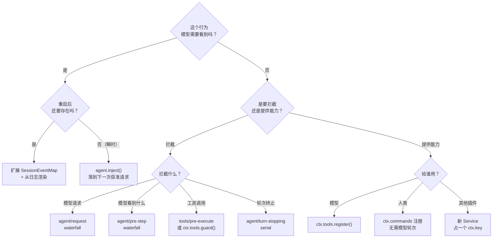

# 我想做 X，挂哪儿

<div class="chapter-meta">
<span class="badge">速查</span>
<span class="badge time">不用读完</span>
<span class="badge">收藏这页</span>
</div>

<div class="callout tip">
<span class="callout-title">这页不是用来读的</span>
前面十四章是学，这页是<strong>查</strong>。有想法的时候回来扫一眼，看有没有现成的扩展点。<br><br>
主表来自架构文档，是<strong>权威映射</strong>——循环本身改动时它会同步更新。
</div>

## 核心映射表

| 目标 | 机制 |
|---|---|
| 添加模型提供方 | 在 `ctx.llm` 上注册其适配器 |
| 添加面向模型的能力 | 在 `ctx.tools` 上注册；其 schema 加入提示词组装 |
| 让某个会话拥有不同的能力集合 | 组装一个 agent preset；其中的服务行需要 `isolate` realm |
| 添加 shell 执行 | 注册 `ctx.shell` 后端；本地后端通过 `ctx.subprocess` spawn 进程 |
| 添加持久化终端执行 | 注册 `ctx.terminals` 后端和 `dsh-tool-terminal` |
| 添加用户命令 | 在 `ctx.commands` 上注册；它**无需模型轮次**即可分派 |
| 添加后台工作 | 在 `ctx.jobs` 上注册；`job_*` 工具负责收集或停止 |
| 添加文件系统访问或策略 | 注册 `ctx.fs` 提供方，或监听 `fs/*` 事件 |
| 限制所启动的进程 | 使用 `ctx.sandbox` 后端；消费方在启动进程前包装 argv |
| 拦截请求、工具或轮次 | 使用相应的 `agent/*` 或 `tools/*` 事件；`agent/turn-stopping` 会停止轮次 |
| 添加模型可见上下文 | 调用 `agent.inject()`；它会落到**下一次获准的请求**中 |
| 添加 UI 或编辑器集成 | 驱动 `ctx.agents` 并从 `session/event` 渲染 |
| 添加 Web Client Chat 节点 | 注册 `ConversationNodeDefinition` + keyed renderer |
| 添加持久会话状态 | 扩展 `SessionEventMap`；从日志渲染和回放 |
| 生成会话标题 | 注册**唯一的** `ctx.sessionTitle` 提供方 |
| 管理同会话目标 | 使用 `ctx.goals`；通过 `agent/*` 续跑 |
| fork 活跃会话 | `ctx.sessions.fork(source, boundary?, childSessionId?)` |
| 将注册项限定到单个 agent | 使用该 agent 的 `agent.ctx` |

<div class="srcref">来源：docs/architecture.zh.md#新行为的归属位置</div>

## 决策树：我该用哪个扩展点



## 三个事件域的选择

选错域是最常见的架构错误。判据：

| 需求 | 事件域 |
|---|---|
| 这个事实必须在重新加载后仍然存在 | **会话事件**（追加到日志，`session/event` 广播） |
| 要观察或拦截**进行中**的工作 | **Agent 事件**（`agent/*`），携带活跃 `Agent` |
| 给某个 seam 附加策略或适配器 | **能力事件**（`fs/*`、`tools/*`、`telemetry/*`） |

## waterfall 事件速查

所有这些都是 waterfall，**监听器必须调 `next()` 才能委托**：

| 事件 | 可以做什么 |
|---|---|
| `agent/pre-step` | 改写已领取的消息，或直接拒绝（决定模型看到什么） |
| `agent/request` | 替换模型调用配置 |
| `agent/request-error` | 返回重试动作，或保留原始错误 |
| `llm/stream` | 包装流式输出 |
| `system-prompt/assemble` | 参与提示词组装 |
| `tools/pre-execute` | 允许／拒绝／询问策略；钩子、权限、沙箱 |
| `tools/execute` | 环绕分发：超时、重试、指标 |
| `tools/post-execute` | 接受、阻止、替换、追加上下文 |
| `approval/request` | 策略代替用户作答 |

**例外**：`agent/turn-stopping` 是 **serial**，**没有 `next()`**。

## 非 waterfall 的观察点

| 事件 | 性质 |
|---|---|
| `session/event` | **同步通知**。持久化插件把事件复制到逐会话控制器，不阻塞生产方 |
| `tools/result` | **同步通知**，观察冻结的权威结果，**不能改变它** |
| `agent/status` | agent 状态变化（running / idle） |
| `agent/inbox/*` | inbox 的 spliced / inserted / claimed |

## 常见任务的完整路径

### 「我要给某个工具加权限确认」

1. 写一个 `tools/pre-execute` 监听器，返回 `ask` 决策
2. `ctx.approval` 会在**单调守卫之前**处理这次询问
3. 缺失或无法作答 → **拒绝**
4. 如果需要**不可撤销**的否决，用 `ctx.tools.guard()` 而不是 pre-execute

参考：`docs/cookbook/extension-cookbook.md#a-hook-plugin-permission-gate-example`

### 「我要给模型加一个新工具」

1. `defineTool({ name, description, parameters, output, execute })`
2. `ctx.tools.register(...)`，`inject: ['tools']`
3. **提前决定 UI 渲染意图**：`generic` / `terminal` / `diff` + `locations`
4. schema 自动流入系统提示词组装——不用手动加
5. Code Mode 自动接入 `await tools.<name>(args)`

### 「我要让 agent 在某个条件下停下来」

用 `agent/turn-stopping`——它是 **serial 终止检查点**，在「自然停止且 next-step inbox 为空」时触发。

### 「我要注入一段上下文让模型下次看到」

```ts
agent.inject({ content, source: { kind: 'plugin', plugin: '<name>' } })
```

<div class="callout warn">
<span class="callout-title">inject 不是唤醒</span>
「这不是唤醒（空闲的 agent 保持空闲）。」注入的上下文<strong>留在 inbox 里</strong>，直到另一条消息把它唤醒。要防范已 dispose 的 agent（try/catch）。
</div>

### 「我要换掉整个 agent loop」

`ctx.agentLoop` 就是一个可替换的具体驱动器。但注意规约：

> **Plugins, not loop changes**：新行为走文档记录的扩展点；**改 `agent-loop` 需要同时更新 `docs/architecture.md`**。

所以先确认你的需求真的没法用扩展点表达。

## 相关文档索引

| 想深入 | 去读 |
|---|---|
| 扩展实操手册（功能 → 能力映射） | `docs/cookbook/extension-cookbook.md` |
| 加一个包 | `docs/cookbook/adding-a-package.md` |
| 加一个工具 | `docs/cookbook/adding-a-tool.md` |
| 加一个 LLM 适配器 | `docs/cookbook/adding-an-llm-adapter.md` |
| 加一个 Chat 节点 | `docs/cookbook/adding-a-conversation-node.md` |
| 每个事件的生产方与消费方 | `docs/event-producer-consumer.md` |
| 生成的配置目录 | `docs/config-catalog.md` |
| 工具目录 | `docs/tool-catalog.md` |
| 持久化日志事件目录 | `docs/persistence-catalog.md` |
| 防御式编程模式 | `docs/defensive-patterns.md`（**动 lifecycle / 并发 / 子进程 / teardown 之前必读**） |

下一章：[术语表](#/ref-glossary)。
